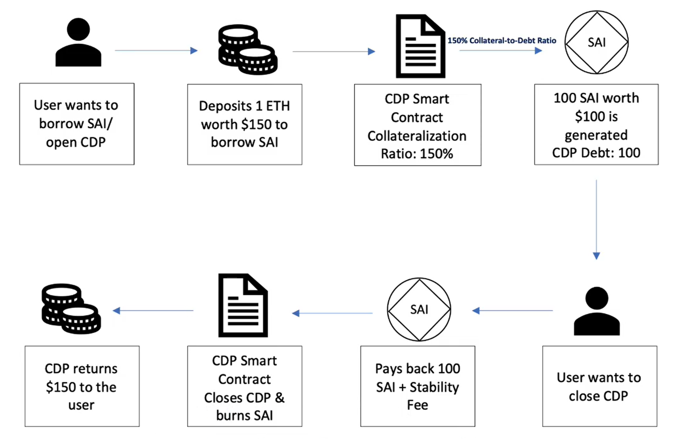
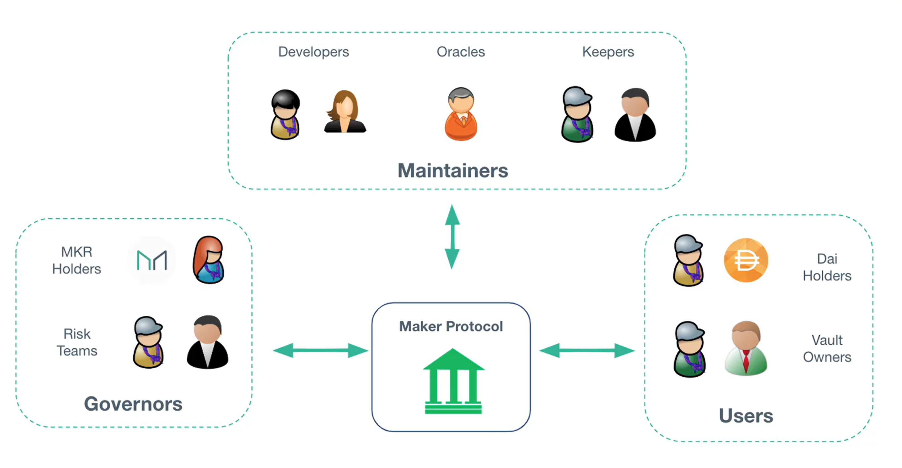

# MakerDAO

---

## Crypto-backed

---

Crypto-backed类型的stablecoin是由其他加密资产（例如ETH）作为支撑的。它们的价格随着底层资产（即抵押物）的价值而波动的。由于ETH的价格可能波动，这些stablecoin需要**超额抵押**来确保价值稳定。这种方法意味着价值$1美元的稳定币需要有至少价值$2美元的加密资产进行抵押。如果ETH的价格下跌，则需要更多的ETH支撑stablecoin。

优点：

- 透明且完全去中心化
- 快速转化为其它加密资产
- 没有外部监管—所有资产由以太坊账户完全控制

缺点：

- 不如法币支撑的stablecoin稳定
- 你需要对抵押的加密货币的价值波动保持关注

### DAI

DAI是目前市值排名第三的stablescoins，被去中心化应用程序广泛接受。它是由Maker Protocol的主要产品，由MakerDAO管理，MKR是MakerDAO的治理代币。官网：[MakerDAO | An Unbiased Global Financial System](https://makerdao.com/en/)

![上图是借出DAI（之前叫SAI）的整个基本流程，实际上和传统银行贷款流程差不多，都需要一定价值的抵押物，还钱需要一部分利息。]

上图是借出DAI（之前叫SAI）的整个基本流程，实际上和传统银行贷款流程差不多，都需要一定价值的抵押物，还钱需要一部分利息。

DAI是Crypto-backed类型的stablescoins，并没有锚定法币，那么它是怎么保证自己1DAI≈1USD的呢？

和现实世界中银行的政策一样，通过对**控制DAI的供应量**来维护自己的价格的稳定。

- 贷款利率：Stability Fee
- 存款利率：DAI Saving Rate（DSR）
- 如果1DAI = 0.99USD，提高利率（减少DAI的市场供应量）
- 如果1DAI=1.01USD，降低利率（增加DAI的市场供应量）

1.Users

- DAI Holders：持有DAI的用户。
- Vault Owners：用户可以把自己手中其他的加密资产抵押给平台，平台会创建一个Vault锁定这些抵押物，然后根据一定的抵押利率返给用户一定的DAI（比如抵押了价值150$的ETH给合约账户，超额抵押率是150%，合约账户返给用户价值100$的DAI）。

2.Maintainers

- Oracle：Maker Protocol作为一个纯链上协议，是智能合约维护的。当它需要获取各种加密货币的价格时，不能够像传统互联网那样去调用一个中心化的API，因为中心化的API对于区块链上的节点来说是不确定的，不能达成共识，所以需要一个去中心化的技术把现实世界的信息引入到智能合约中，这样智能合约就可以根据这些数据做出相应的决策。Oracle（预言机）就是这样一种技术，它在DeFi等各个领域扮演着重要的角色。
- Developers：开发者
- Keepers：监控协议的进行

3.Governors

- MKR Holders：MKR（Maker DAO的治理代币） 的持有者，可以提案，投票，一个MKR Token等于一个投票权，可以代理
- Risk Teams：对提案进行审查

### **案例分析**

假设1ETH=2000$，质押了5个ETH（10000$）到Maker Vault，按照150%的超额抵押率，最多可以借出10000/150% = 6666.67DAI。保险起见，用户借出5000DAI，其余1666.67为缓冲区。

- 情形1：ETH涨价到3000$，此时Vault中的5个ETH=15000$，基于150%的抵押率，用户最多可以借出10000DAI，用户可以借出更多的DAI。
- 情形2：ETH跌到1500$，此时Vault中的5个ETH=7500$，7500/150%=5000DAI，刚好来到超额抵押率的临界点，用户面临三个选择：
    - 往Maker Vault中质押更多的ETH，增加自己的缓冲区，免得ETH继续下跌，触发清算。
    - 还回5000DAI + Stability Fee，拿回5个ETH。
    - 还回部分DAI + Stability Fee，增加自己的缓冲区，免得ETH继续下跌，触发清算。

**DAI的防护网之一：Colleteral Auction**

- 情形3：ETH跌到1200$，此时Vault中的5个ETH=6000$，触发清算，Keeper介入清算流程：
    - 5个ETH按照市场价折扣3%进行拍卖，每次增加0.5%，直到拍卖成功
    - Keeper使用DAI来竞拍，价高者得
    - 扣除5000DAI + penalty Fee等费用，其余ETH返回给用户

**DAI的防护网之二：Maker Buffer**

*Maker Buffer是由Stability Fee/Penalty Fee等费用缓慢积攒的。*

- 情形4：ETH跌倒900$，此时5ETH=4500$，拍卖后的缺口为用户借出的5000$ - 4500$ = 500$
    - 从Maker Buffer支出500$，弥补缺口

**DAI的防护网之三：Debt Auction**

- 情形5：在情形4的情况下，如果Maker Buffer里只有100DAI，资金缺口为400$
    - 增发价值400$的MKR进行拍卖
    - 用户使用DAI参与拍卖，拍卖得到的DAI来弥补缺口
    - 这是一种对社区治理惩罚的方式，因为增发了治理代币MKR，稀释了MKR的价值
    
    <aside>
    💡 Surplus Auction：当社区治理比较好的时，超出了Maker Buffer Limit，超出限制后的DAI用来购买MKR，销毁MKR，相当于减少了MKR的数量，增加了MKR的价值，这是一种对社区治理的奖励方式。
    
    </aside>