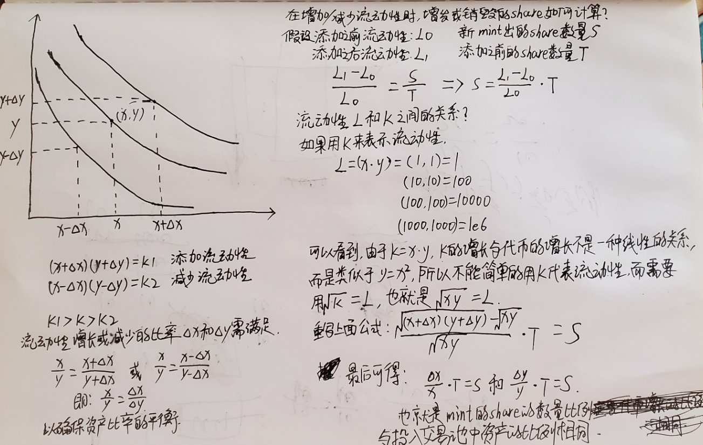
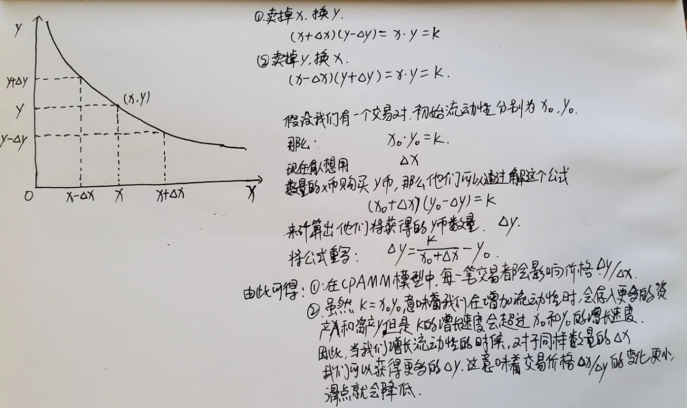

# Uniswap CPAMM

### Constant Product Automated Market Maker

### **$x * y = k$**

x和y代表了一个交易对中各自token的供应量。k是一个不变的常量，k的大小反应了流动性池的大小，如果这个值越大，那么意味着LP提供了更多的资产，交易对的流动性就越大，交易深度也越深。

- **初始化流动性池确定价格**

在许多DeFi项目中，初始的流动性一般由项目方提供以启动交易。在初始化流动性池时，会存入一定数量x的资产A和一定数量的y的资产B。那么初始的交易价格就是x / y 或 y / x。假设提供了100U和1000TokenA，TokenA的初始交易价就为0.1U。如果这个初始交易价和主流市场有价差，那么就存在套利空间，会被市场上的交易机器人搬砖，直到恢复到市场价格。初始化交易价后，每一笔交易都会影响价格。

- **Swap**

- **deposit/withdraw**

