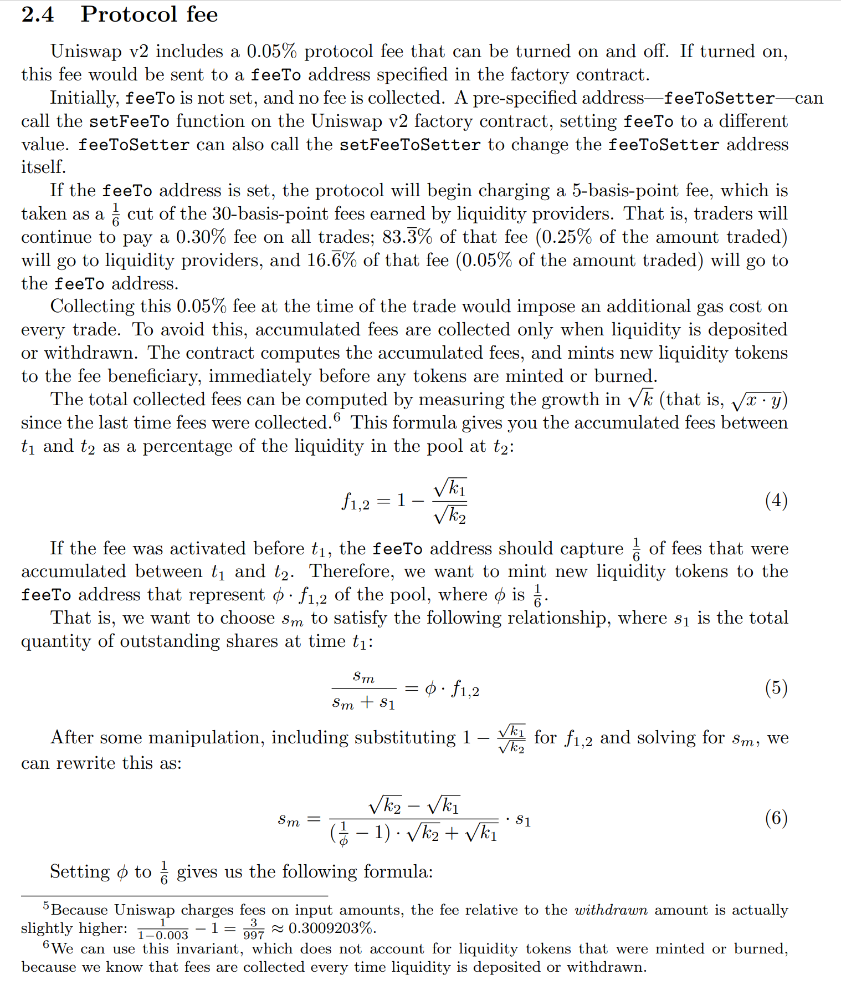
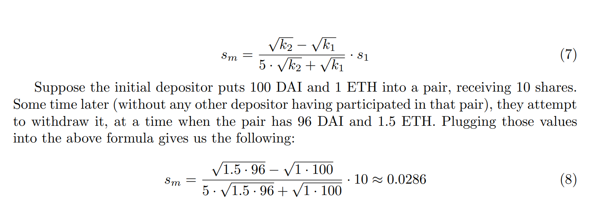
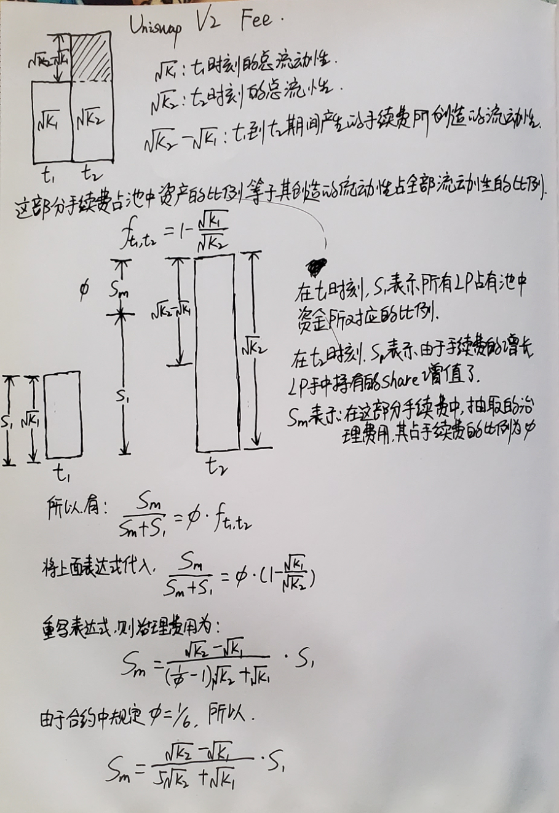

# Uniswap V2 Fee

### 治理费用

在Uniswap V2中，增加了一个接收治理费用的地址，激活这个地址，会从原本LP赚取的30个基点的手续费中抽取5个基点（1/6）作为治理费用。

### 手续费的分配

为了避免在交易时分割5个基点的费用会增加额外的gas成本，累积的手续费只有在LP添加流动性和提取流动性的时候会分配和重新计算。

**例子说明**

假设Ailce 和 Bob是LP：

1. **初始状态：**
- Alice 和 Bob各存入 50 ETH和 50000 DAI，因此他们各自拥有代表池中50%的份额的LPT。
- 池中初始流动性为 100 ETH和 100000 DAI。
1. **交易过程：**
- 用户在池中进行交易，假设产生了 2 ETH和 2000 DAI的手续费。
- 池中的总流动性现在是 101 ETH和 101000 DAI，虽然即没有分配手续费，也没有增发LPT，但是另一方面Alice和Bob手中的LPT更值钱了。
1. **Alice存入更多的流动性：**
- 当Ailce决定再存入 10 ETH 和 10000 DAI时，合约会计算自上次手续费结算后，至今累积的手续费（ 2   ETH和 2000 DAI）。
- 这些累积的手续费将按当前流动性份额分配给Bob和Alice。由于他们之前各自持有代表池中50%份额的LPT，每人将获得1 ETH 和 1000 DAI。
- 此时，池中流动性调整为100 ETH 和 100000 DAI。
- 然后，Alice的添加新的流动性（10ETH 和 10000 DAI）将增加她在池中的份额，并为她铸造相对应的 LPT。
1. **Bob提取流动性：**
- 当Bob决定提取他的流动性时，合约会再次计算自上次手续费结算后，至今累积的手续费，并将这些手续费按当前流动性份额进行分配。
- 假设在这期间没有新的手续费累积，Bob将根据他持有的LPT份额提取相应流动性。

**补充**

在uniswap V2中，累积的手续费是在流动性添加和移除时，系统会重新计算并分配累积的手续费，治理费用的抽取也是在这个阶段（前提是治理费用的地址被激活）。

### 费用的计算

