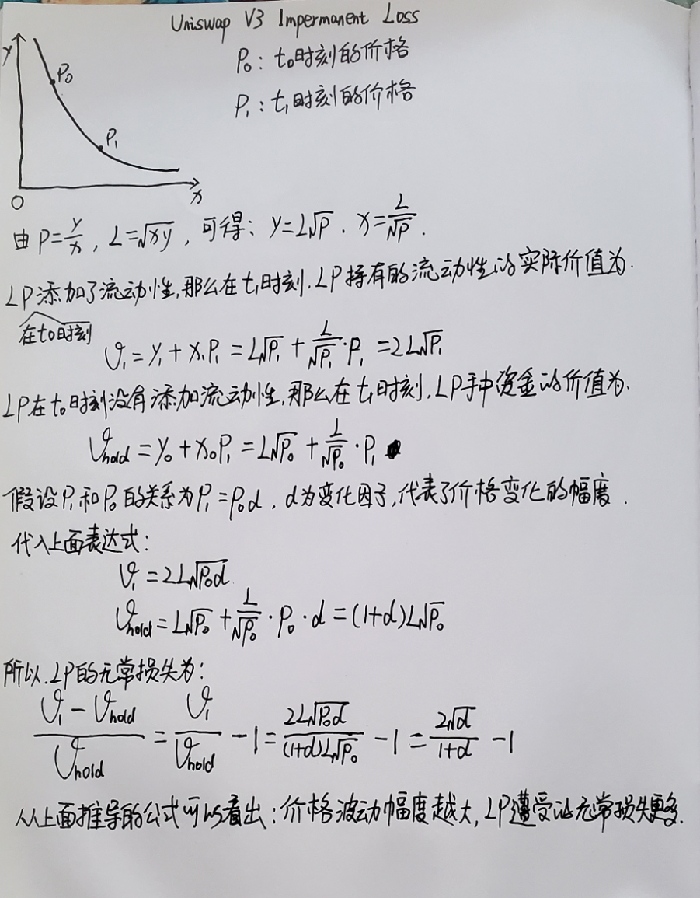

# Uniswap V2 Impermanent Loss

> Impremanent Loss（无常损失），是指由于token价格变化导致LP所持有的流动性遭受的潜在的损失。当两种token的价格比例发生变化时，LP会发现他们持有的代币组合用于添加的流动性的价值，总是会比不添加流动性低。
> 

### 举例：

在一个ETH-DAI的交易对中，LP添加了 1 ETH- 100 DAI 进入流动性池

这部分流动性为：   $\sqrt{1 * 100} =  10$

此时ETH的价格为 100 DAI/ETH

LP拥有的价值为：200 U

- **ETH增值**
    
    ETH增值到：0.83 ETH = 120 DAI 
    
    此时ETH的价格为： 144.58 DAI/ETH
    
    由于LP的流动性不变，  $\sqrt{ 0.83 * 120} = 10$
    
    此时LP拥有代币的数量为 ：0.83 ETH + 120DAI
    
    LP拥有的价值： 0.83 * 144.58 + 120 = 240 U
    
    假设LP最初没有添加流动性，而是持有这些代币，那么此时这些代币的总价值为：
    
    1 * 144.58 + 100  = 244.58 U
    **添加流动性比不添加流动性少赚了 ：244.58 - 240 = 4.58 U**
    
- **ETH贬值**
    
    ETH贬值到：1.25 ETH = 80 DAI
    
    此时ETH的价格为： 64 DAI/ETH
    
    由于LP流动性不变，   $\sqrt{1.25 * 80} = 10$
    
    此时LP拥有的代币数量为： 1.25 ETH + 80 DAI
    
    LP拥有的价值： 1.25 * 64 + 80 = 160 U
    
    假设LP最初没有添加流动性，而是持有这些代币，那么此时这些代币的总价值为：
    
    1 * 64 + 100 = 164 U
    
    **添加流动性比不添加流动性多亏了： 164 - 160 = 4 U**
    
    <aside>
    💡 从上面的例子可以看出来，添加了流动性后，无论价格是涨还是跌，只要价格比例发生变化，总是会发生亏损（少赚或多亏），这部分亏损也就是无常亏损。所以Uniswap需要用手续费来补偿这部分亏损。
    
    </aside>
    
    ### 用数学模型来计算无常亏损
    
    图中笔误，实际为UniswapV2
    