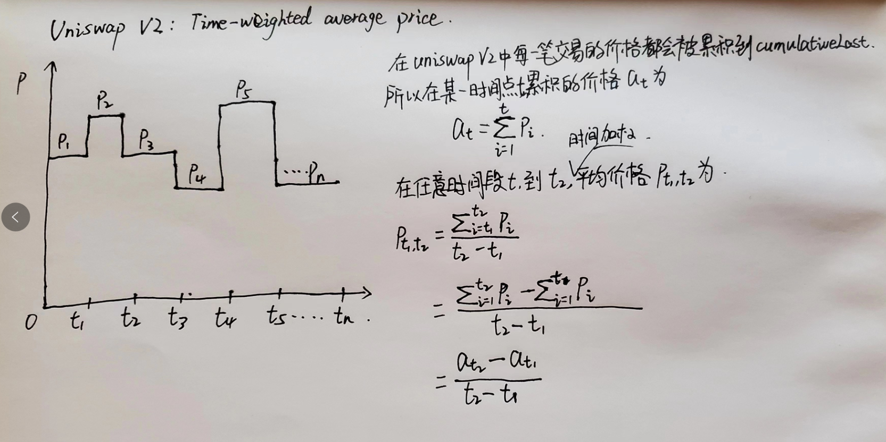

# Uniswap V2 Price Oracle

## Time-weighted average price

> 在Uniswap V2中提供一种TWAP（时间加权平均价格）的预言机，它在金融领域和区块链领域常用于计算一段时间内资产价格的平均值，相比于实时价格更能反应资产在该时间段内的总体表现。同时作为预言机，也更加安全，更难被操纵。
> 

**注意**

在UniswapV2Pair合约中，只是在每次发生交易的时候，累积了价格**price0CumulativeLast**、**price1CumulativeLast**，更新了最近一次修改的时间**blockTimestampLast**。所以如果需要使用预言机追踪某一时间段的平均价格，需要自己追踪这三个字段的变化，然后和时间做加权。