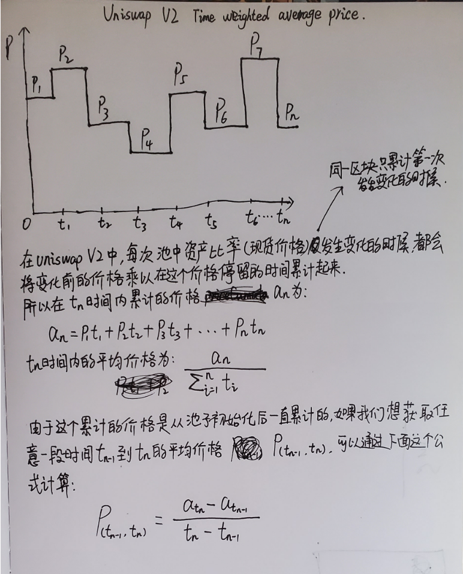
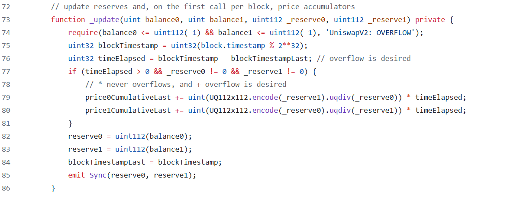
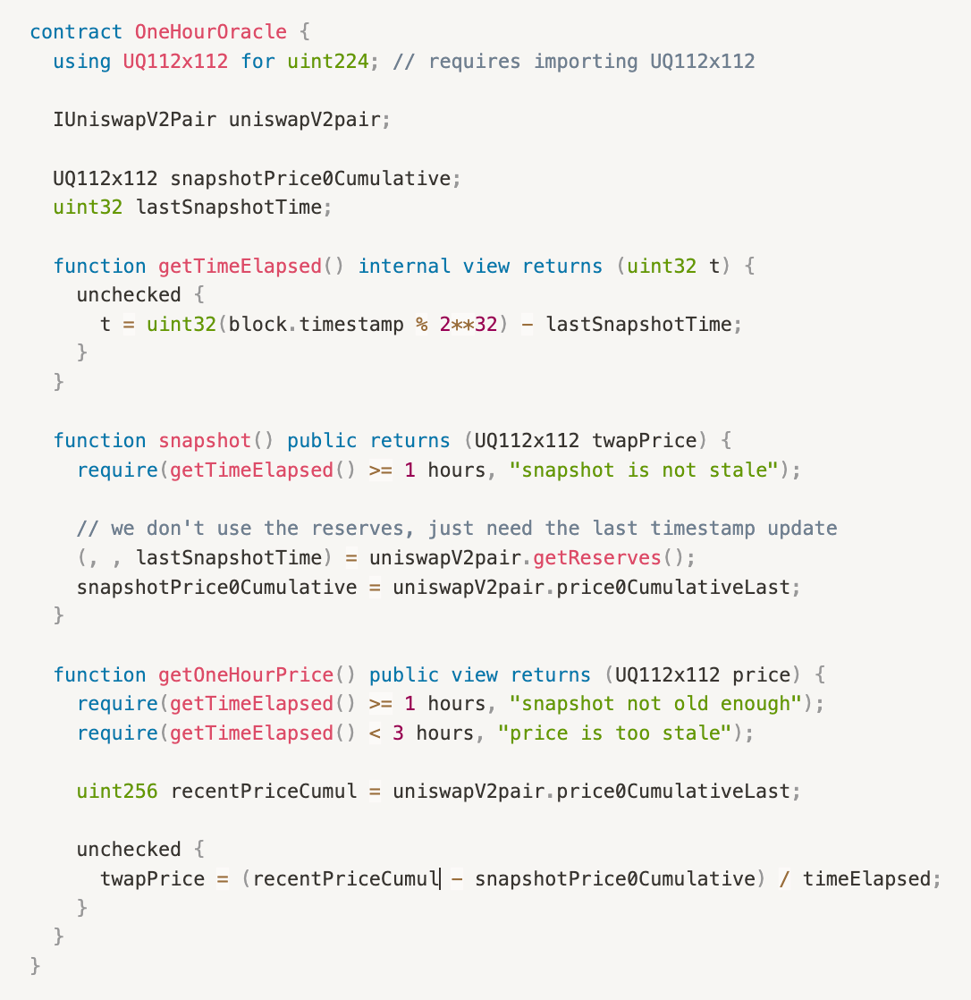

# Uniswap V2 TWAP

## Time weighted average price
在Uniswap V2中提供一种TWAP（时间加权平均价格）的预言机，它提供了一种机制，可以获取前一个时间段内的平均价格。这意味着攻击者必须不断操纵多个区块的价格，这种成本是难以估量的。

预言机的目标用户是其他智能合约，价格消费者可以轻松与Uniswap协议在链上交互获取价格。

## TWAP的数学计算




## 代码解析



### 如何累计价格？
1. `_update`函数在只会在`mint`,`burn`,`swap`中被调用，也就是说每当池子中资产比率发生变化的时候，都会累计一次价格。
2. `blockTimestampLast`记录了上一次累计价格的时间戳。计算两次变化的间隔时间：`timeElapsed = blockTimestamp - blockTimestampLast`。值得注意的是，`blockTimestamp`是区块的时间戳，也就是说，同一区块内当多次调用`_update`函数时，只有第一次才会累计价格。这意味着攻击者想操纵价格，必须不断的操纵多个区块的第一笔交易，这基本是不可能实现的。
3. `UQ112x112.encode(_reserve1).uqdiv(_reserve0)`，因为solidity除法的舍入阶段问题，这里计算资产比率时，使用了定点运算的方式，精度是2 ^ 112。
4. `price0CumulativeLast`和`price1CumulativeLast`是uint类型，一个slot是32个字节，也就是他们最大可以表示为
 $2^{256} - 1$。当超过这个值时，会发生溢出。uniswapV2是solidity0.8之前的版本实现，不会因为溢出而revert，只从零开始计算。
   - 假设，token0上一次累计的价格是$2^{256} - 10$，当前累计价格是$2^{256} + 10$。从数学运算上讲，他们的差值是20。
   - 但是实际上当前累计价格因为溢出，会记录为10。实际计算：$10 - (2^{256} - 10)$，结果为$-2^{256} + 20$。由于uint类型是无符号整数，所以最后结果还是20，符合数学运算的结果。
5. 时间间隔`timeElapsed`的计算和上面同理。

### 如何计算平均价格？
**从上面代码可以看到uniswapV2的代码中，只是不停的记录了累计价格，那我们怎么计算我们想要的平均价格呢？**

从我们上面推导出来的公式可以发现，我们只需要按照我们需要的时间点去获取两个时间点累计价格的快照，就可以算出平均价格。也就是定时读取`uniswapV2Pair`的存储变量`price0CumulativeLast`或`price1CumulativeLast`。下面是一个简单的实现：



**如果最后一次快照是三小时之前的快照怎么办？**
在上面的合约中如果，在三小时内`_update`函数没有被`mint`,`burn`,`swap`调用，则无法快照。`uniswapV2Pair`提供了另外一个函数，让我们手动去调用：
```solidity
function sync() external lock {
    _update(IERC20(token0).balanceOf(address(this)), IERC20(token1).balanceOf(address(this)), reserve0, reserve1);
}
``` 

### 为什么TWAP分别跟踪两种token的累计价格？
token0的价格实际上是token1的数量和token0数量的比率，反之亦然。实际上两种价格就是分子和分母颠倒的数字。但是当我们累计价格时，就不能通过反转其中一个累计价格来获得另外一个累计价格了，比如：
- token0的累计价格：$2 + 3$
- token1反转后：$\frac{1}{2 + 3}$
- token1实际的累计价格：$\frac{1}{2} + \frac{1}{3}$

