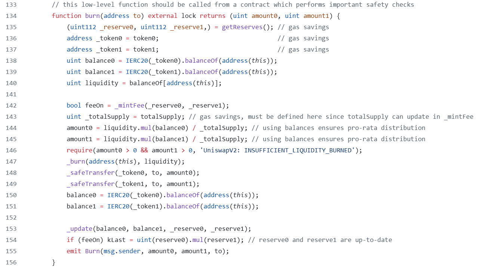
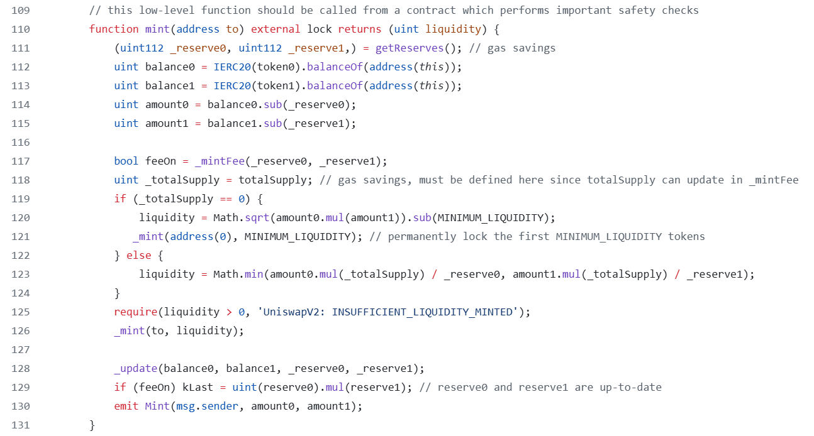

# Uniswap V2 mint/burn

## burn代码解析



### 移除的流动性是通过池合约收到的LP token数量来衡量的
```solidity
uint liquidity = balanceOf[address(this)];
```
直接与`burn`函数交互，需要在调用前向池合约转入LP token。这两次调用需要在一个交易内，否则其他人可以燃烧掉你的LP token并偷走你的流动性。

### 计算移除的流动性资产
```solidity
uint _totalSupply = totalSupply; 
amount0 = liquidity.mul(balance0) / _totalSupply; 
amount1 = liquidity.mul(balance1) / _totalSupply; 
require(amount0 > 0 && amount1 > 0, 'UniswapV2: INSUFFICIENT_LIQUIDITY_BURNED');
```
计算公式是：$LPTokenAmout * balance0 / totalSupply$，$LPTokenAmout * balance1 / totalSupply$。这个公式在上面已经推导过。值得注意得是，token0和token1的资产比例可能会在发起调用`burn`交易和交易被确认之间发生变化，所以如果直接与`burn`函数交互，且用户合约有依赖接受特定数量的token0或token1的下游逻辑（例如偿还闪电贷），则该逻辑可能会中断。用户合约必须检查token0或token1少于预期的情况。

## mint代码解析



### 初始化流动性问题
```solidity
if (_totalSupply == 0) {
    liquidity = Math.sqrt(amount0.mul(amount1)).sub(MINIMUM_LIQUIDITY);
    _mint(address(0), MINIMUM_LIQUIDITY); // permanently lock the first MINIMUM_LIQUIDITY tokens;
}
```

和任何vault类型的合约一样，UniswapV2也需要防御“通货膨胀攻击”。UniswapV2的防御措施是在第一笔流动性被添加的时候，将`MINIMUM_LIQUIDITY`数量流动性对应的LP token发送到零地址，相当于锁死了这部分流动性。以确保没有人可以拥有池中所有流动性份额，从而发动通货膨胀攻击。

### 当池子不为空时添加流动性
```solidity
liquidity = Math.min(amount0.mul(_totalSupply) / _reserve0, amount1.mul(_totalSupply) / _reserve1);
```
1. 和`burn`中情况类似，LP token的总供应量和池中资产可能会在发起调用`mint`交易和交易被确认之间发生变化，因此用户合约必须实施必要的滑点保护和资产比例检查。

2. 用户将会获得提供的两种token中计算出来那个最小值的流动性份额，激励用户添加与池中资产比例相等的流动性，否则将会遭受损失。这是为了保护其他LP的资产。我们可以看下下面这个例子。
- 假设池子当前有100个token0和1个token1，LP Token的总供应量为10
- 假设token0的总价值为100美元，token1的总价值为100美元，池子的总资产为200美元
- 如果有人添加了10token0（10美元）和1个token1（100美元），总成本110美元
- amount0 * totalSupply / reserve0 = 10 * 10 / 100 = 1
- amount1 * totalSupply / reserve1 = 1 * 10 / 1 = 10
- 如果取最大值，他将获得10个LP token，意味着他拥有了LP token总供应量的50%
- 但是他的流动性资产只占到了池中所有资产的：110 / 310 = 35.4%，相当于他偷走了其他LP的资产


