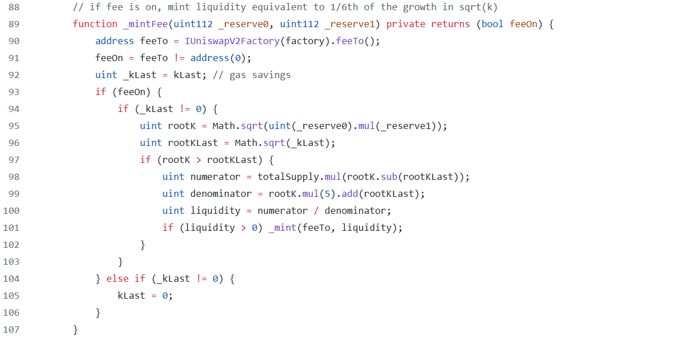
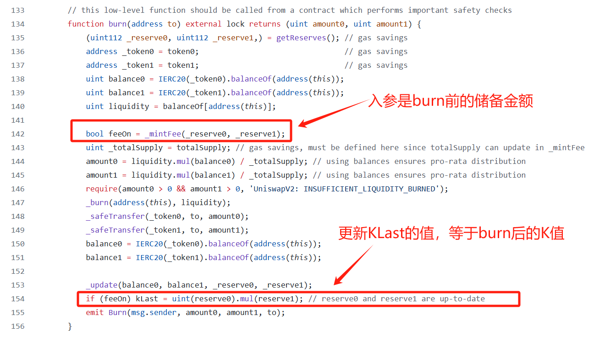

# Uniswap V2 mintFee

> 在之前的章节，我们提到过在用户发起一笔 swap 交易的时候，会从 tokenIn 中扣除千三的手续费留存在池子中，这部分就是 LP 的收益。而实际上 uniswapV2 还有一个机制，在这部分手续费中，还会再扣除六分之一(mintFee)，也就是每笔交易的 0.05%会归入协议（uniswapV2 并未真正启用这个功能）

### 如何收取 mintFee？

在之前的章节，我们知道 LP 每次添加和退出流动性的时候，会增发或销毁 share 代币，从而增加或减少他们对池子流动性的份额。而收取 mintFee 的时机就在这里，也就是只要有人调用了`mint`或`burn`这两个函数，就会对之前留存在池子中的手续费中扣除六分之一，结清一次 mintFee，方式是将对应的这六分之一流动性份额的 share 代币发送给协议的规定的地址。

### 数学计算

假设：

$t_1$时刻池中的流动性为$\sqrt{k_1}$

$t_2$时刻池中的流动性为$\sqrt{k_2}$

如果$t_1$到$t_2$期间没有 LP 添加或退出流动性，$t_1$到$t_2$池子中累积的手续费所创造的流动性为$\sqrt{k_2}-\sqrt{k_1}$

其流动性占池子总流动性的份额为 $f = \frac{\sqrt{k_2} - \sqrt{k_1}}{\sqrt{k_2}} = 1 - \frac{\sqrt{k_1}}{\sqrt{k_2}}$

归入协议的 mintFee 占这部流动性的六分之一，那么 mintFee 占池子总流动性的份额$f_m = \frac{1}{6} - \frac{\sqrt{k_1}}{6 \cdot \sqrt{k_2}}$

由于 LP 代币和池子中的流动性成正比，设 LP 代币的总供应量为$S_t$,分配给协议的 LP 代币为$S_m$,则有：

$\frac{S_m}{S_t} = \frac{1}{6} - \frac{\sqrt{k_1}}{6 \cdot \sqrt{k_2}}$

求解，可得 $S_m = \frac{\sqrt{k_2} - \sqrt{k_1}}{5 \cdot \sqrt{k_2} + \sqrt{k_1}} \cdot S_t$

## mintFee 代码解析

`_mintFee`是一个私有函数，让我们看看在哪里会调用到它

结合上面的代码，可以发现

- `_mintFee`只会在添加或移除流动性的时候会被调用
- 只有设置了`feeTo`地址才会分配治理费用
- 计算过程和我们上面推导的出的公式的代码实现

  让我们考虑一下上面代码片段中的可能性，梳理出一下逻辑：

  
