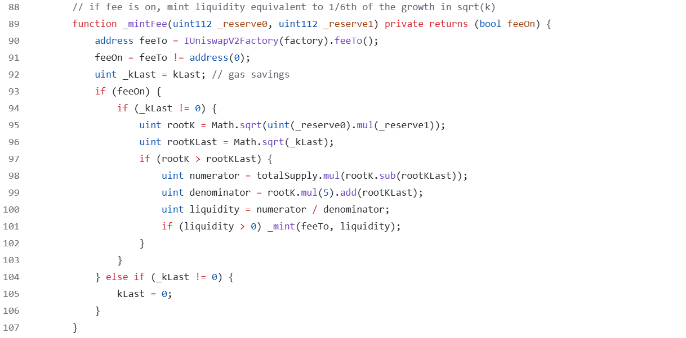
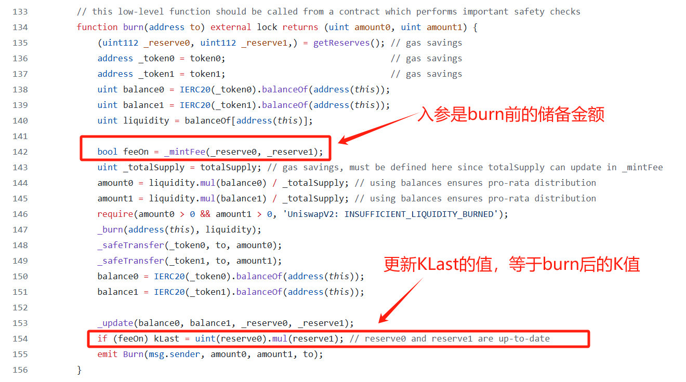
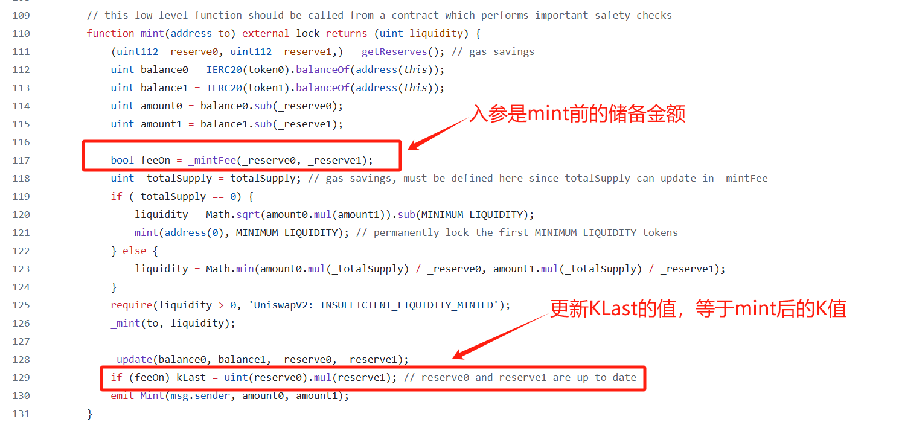
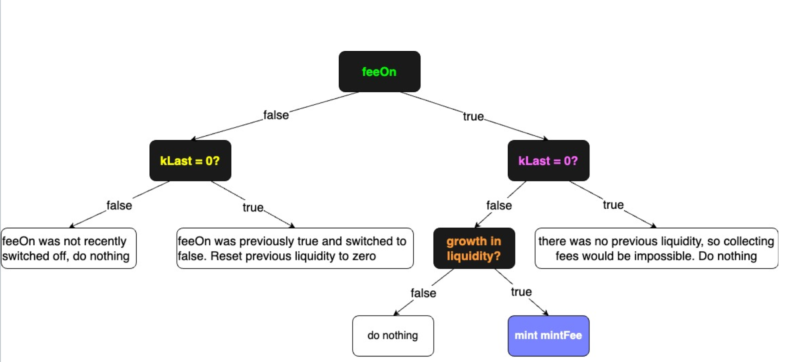

# Uniswap V2 protocolFee

## mintFee代码解析

`_mintFee`是一个私有函数，让我们看看在哪里会调用到它

结合上面的代码，可以发现
- `_mintFee`只会在添加或移除流动性的时候会被调用
- 只有设置了`feeTo`地址才会分配治理费用
- `KLast`是上次结算后的K值，`rootKLast`是上次结算后的流动性
- `rootK`是当前池中的流动性
- 计算过程和我们上面推导的出的公式的代码实现
  
  让我们考虑一下上面代码片段中的可能性，梳理出一下逻辑：

  

