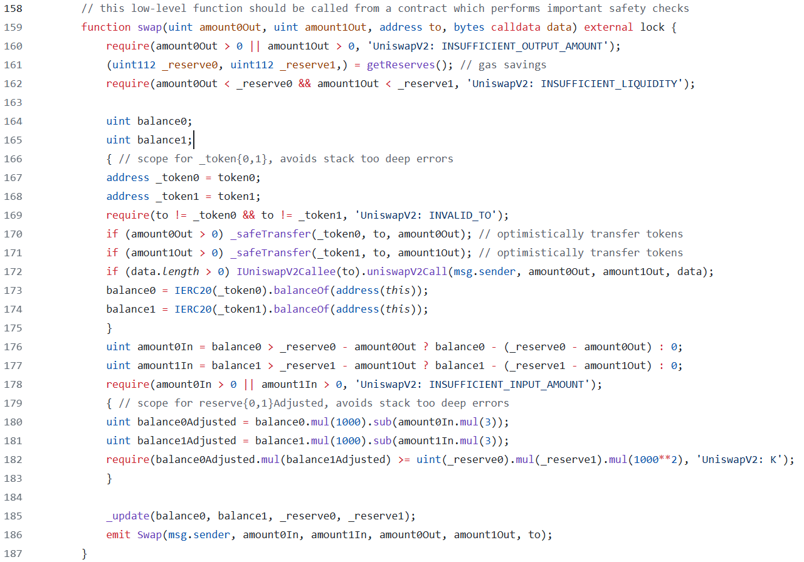

# Uniswap V2 Swap


## Swap代码解析



### 计算转入token的数量
  ```solidity
  uint amount0In = balance0 > _reserve0 - amount0Out ? balance0 - (_reserve0 - amount0Out) : 0;
  uint amount1In = balance1 > _reserve1 - amount1Out ? balance1 - (_reserve1 - amount1Out) : 0;
  require(amount0In > 0 || amount1In > 0, 'UniswapV2: INSUFFICIENT_INPUT_AMOUNT');
  ```
`_reserve0`和`_reserve1`是池中交易对原本的储备数量，`balance0`和`balance1`分别代表转出`amount0Out`和`amount1Out`后的数量。

对于交易对中两个token中的任意一个，都可能发生以下两种情况之一：
1. token的数量净增长
2. token的数量净减少或者没有变化
   
假设
- reserve为10,amountOut为0，balance为12。这意味着用户存入了两个token，转入token的数量amountIn为2。
- reserve为10,amountOut为7，balance为3。这意味着用户收到了7个token，转入token的数量amountIn为0。
- reserve为10,amountOut为7，balance为18。这意味着用户使用闪电贷借入了7个代币，但多偿还了8个代币，转入的token数量amountIn为15，相当于用户在归还闪电贷的同时做了一次swap操作，所以需要对贷款部分和swap部分都要收取手续费。


如果token的数量有净增长，amount0In或amount1In将代表用户转入的token数量。require中校验用户至少转入了一种类型的token。

### 校验K值
```solidity
uint balance0Adjusted = balance0.mul(1000).sub(amount0In.mul(3));
uint balance1Adjusted = balance1.mul(1000).sub(amount1In.mul(3));
require(balance0Adjusted.mul(balance1Adjusted) >= uint(_reserve0).mul(_reserve1).mul(1000**2), 'UniswapV2: K');
```

**费用的计算**

uniswapV2每次swap都会收取0.3%的手续费，手续费是在转入的token中扣除的，新的K值计算将不会包含这部分手续费，这就是为什么我们看到`sub(amountXIn.mul(3))`的原因。代码中使用了一种巧妙的方法，用乘法代替了除法，这是因为solidity中除法存在舍入截断，结果会不够精确。

**K值并不是真正恒定的**

尽管CPAMM被称为“恒定乘积自动做市商”，但实际上在swap中K并不是真正意义上恒定不变的。除了手续费导致K值固定变大之外，如果有人向池子捐赠了代币改变了K值，或者在swap过程中转入了过多的token，协议并不想阻止这种行为，因为它们让LP赚了钱。（这与router中的一项检查有关，通过router与协议交互，将会检查转入和收到的数量，避免交易者的损失）。
所以在最后require中，协议只会检查扣除了手续费swap后的K值只需要大于或等于原本的K值。


### 闪电贷
```solidity
if (amount0Out > 0) _safeTransfer(_token0, to, amount0Out); // optimistically transfer tokens
if (amount1Out > 0) _safeTransfer(_token1, to, amount1Out); // optimistically transfer tokens
if (data.length > 0) IUniswapV2Callee(to).uniswapV2Call(msg.sender, amount0Out, amount1Out, data);
```
- swap函数作为闪电贷使用。只需要传入希望借入的token数量`amount0Out`和`amount1Out`,希望转入的地址`to`。
- `to`合约必须实现`uniswapV2Call`函数，作为回调函数，在`uniswapV2Call`函数中，用户可以自定义一些操作，且必须在最后偿还贷款和费用，否则在计算转入token数量阶段或校验K值阶段会revert。还款可以不必是借款数量`amount0Out`和`amount1Out`，只要满足扣除了手续费后的K值大于或等于原本的K值就可以，这实际上是做了一次swap操作。

### 直接与swap交互
- 如果不使用闪电贷，必须在调用swap函数前先向池子转入作为交易的token。只有智能合约才能这样做。
- AmountOut不够灵活，它是作为参数提供的。如果amountIn不够，交易将revert，gas将被浪费；如果amountIn过多，用户可能遭受损失。