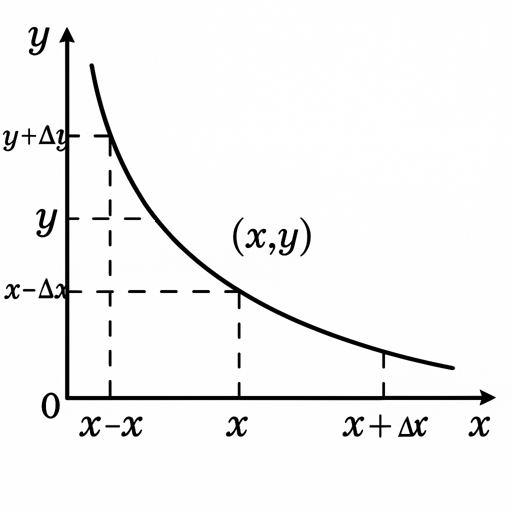
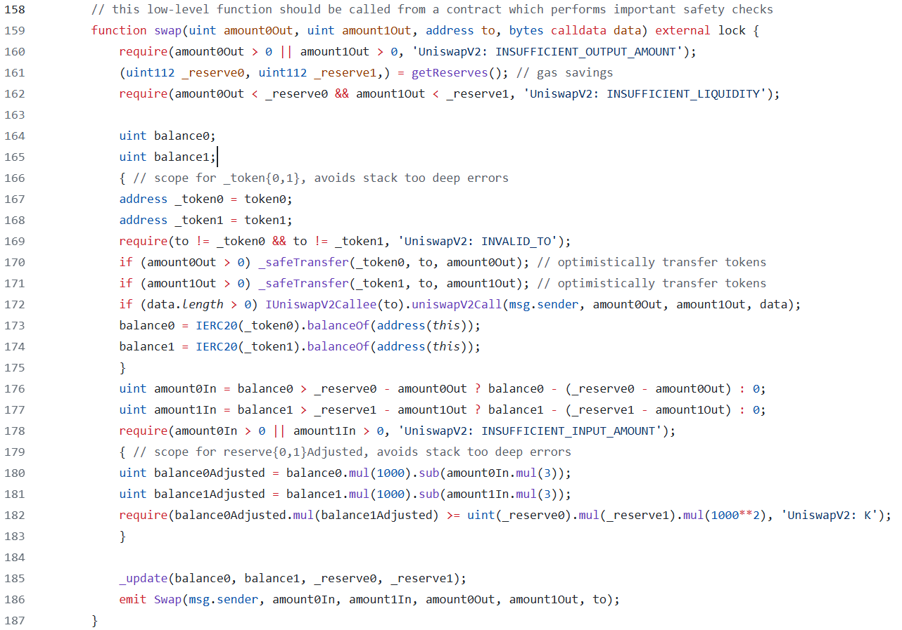

# Uniswap V2 Swap

## 价格曲线



_在实际交易中，价格并不是按照$x/y$ 或者 $y/x$来计算，而是围绕着：$x \cdot y = k$，K 值应该保持不变来计算价格。所以其价格变化应该是类似于上面的价格曲线。_

### 数学计算

假设某个交易对有$x$数量的 token A 和$y$数量的 tokenB，有人想用$\Delta x$数量的 token A 兑换 token B，他应该得到的 token B 的数量为$\Delta y$,计算过程如下：

$$
(x + \Delta x)(y - \Delta y) = x y
$$

求解$\Delta y$：

$$
\Delta y = y - \frac{xy}{x + \Delta x} = \frac{y\Delta x}{x+ \Delta x}
$$

在这个公式基础上，uniswap 会对每次 swap 收取千分之 3 的手续费，这个手续费只针对用户存入的资产，所以实际到手的 token B 的数量$\Delta y$为：

$$
\Delta y = \frac{y(\Delta x \cdot 99.7\%)}{x+ (\Delta x \cdot 99.7\%)} = \frac{997y\Delta x}{1000x + 997\Delta x}
$$

由于这部分手续费是留存在池子中的，所以实际中的 K 值并不是始终不变的，而是随着交易次数逐渐增加的。增加的这部分流动性实际就是 LP 的收益。

## 代码解析



### 计算转入 token 的数量

```solidity
uint amount0In = balance0 > _reserve0 - amount0Out ? balance0 - (_reserve0 - amount0Out) : 0;
uint amount1In = balance1 > _reserve1 - amount1Out ? balance1 - (_reserve1 - amount1Out) : 0;
require(amount0In > 0 || amount1In > 0, 'UniswapV2: INSUFFICIENT_INPUT_AMOUNT');
```

`_reserve0`和`_reserve1`是池中交易对原本的储备数量，`balance0`和`balance1`分别代表转出`amount0Out`和`amount1Out`后的数量。

对于交易对中两个 token 中的任意一个，都可能发生以下两种情况之一：

1. token 的数量净增长
2. token 的数量净减少或者没有变化

假设

- reserve 为 10,amountOut 为 0，balance 为 12。这意味着用户存入了两个 token，转入 token 的数量 amountIn 为 2。
- reserve 为 10,amountOut 为 7，balance 为 3。这意味着用户收到了 7 个 token，转入 token 的数量 amountIn 为 0。
- reserve 为 10,amountOut 为 7，balance 为 18。这意味着用户使用闪电贷借入了 7 个代币，但多偿还了 8 个代币，转入的 token 数量 amountIn 为 15，相当于用户在归还闪电贷的同时做了一次 swap 操作，所以需要对贷款部分和 swap 部分都要收取手续费。

如果 token 的数量有净增长，amount0In 或 amount1In 将代表用户转入的 token 数量。require 中校验用户至少转入了一种类型的 token。

### 校验 K 值

```solidity
uint balance0Adjusted = balance0.mul(1000).sub(amount0In.mul(3));
uint balance1Adjusted = balance1.mul(1000).sub(amount1In.mul(3));
require(balance0Adjusted.mul(balance1Adjusted) >= uint(_reserve0).mul(_reserve1).mul(1000**2), 'UniswapV2: K');
```

**费用的计算**

uniswapV2 每次 swap 都会收取 0.3%的手续费，手续费是在转入的 token 中扣除的，新的 K 值计算将不会包含这部分手续费，这就是为什么我们看到`sub(amountXIn.mul(3))`的原因。代码中使用了一种巧妙的方法，用乘法代替了除法，这是因为 solidity 中除法存在舍入截断，结果会不够精确。

**K 值并不是真正恒定的**

尽管 CPAMM 被称为“恒定乘积自动做市商”，但实际上在 swap 中 K 并不是真正意义上恒定不变的。除了手续费导致 K 值固定变大之外，如果有人向池子捐赠了代币改变了 K 值，或者在 swap 过程中转入了过多的 token，协议并不想阻止这种行为，因为它们让 LP 赚了钱。（这与 router 中的一项检查有关，通过 router 与协议交互，将会检查转入和收到的数量，避免交易者的损失）。
所以在最后 require 中，协议只会检查扣除了手续费 swap 后的 K 值只需要大于或等于原本的 K 值。

### 闪电贷

```solidity
if (amount0Out > 0) _safeTransfer(_token0, to, amount0Out); // optimistically transfer tokens
if (amount1Out > 0) _safeTransfer(_token1, to, amount1Out); // optimistically transfer tokens
if (data.length > 0) IUniswapV2Callee(to).uniswapV2Call(msg.sender, amount0Out, amount1Out, data);
```

- swap 函数作为闪电贷使用。只需要传入希望借入的 token 数量`amount0Out`和`amount1Out`,希望转入的地址`to`。
- `to`合约必须实现`uniswapV2Call`函数，作为回调函数，在`uniswapV2Call`函数中，用户可以自定义一些操作，且必须在最后偿还贷款和费用，否则在计算转入 token 数量阶段或校验 K 值阶段会 revert。还款可以不必是借款数量`amount0Out`和`amount1Out`，只要满足扣除了手续费后的 K 值大于或等于原本的 K 值就可以，这实际上是做了一次 swap 操作。

### 直接与 swap 交互

- 如果不使用闪电贷，必须在调用 swap 函数前先向池子转入作为交易的 token。只有智能合约才能这样做。
- AmountOut 不够灵活，它是作为参数提供的。如果 amountIn 不够，交易将 revert，gas 将被浪费；如果 amountIn 过多，用户可能遭受损失。
