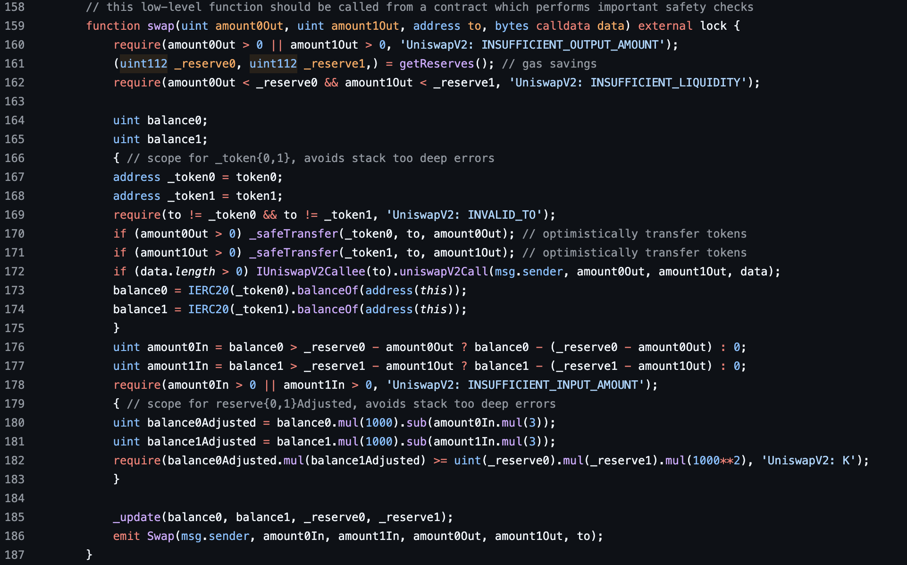
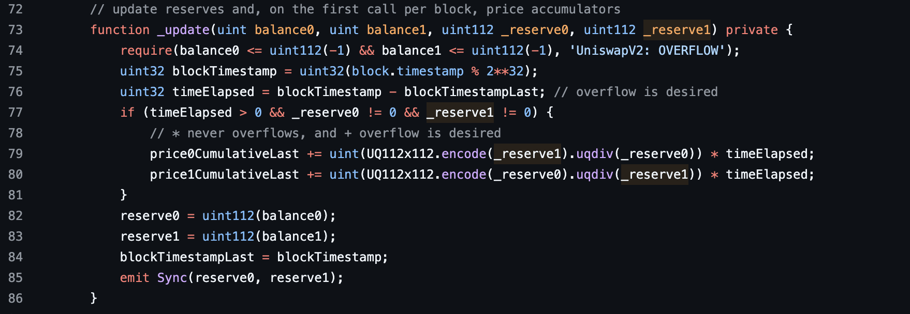

# Uniswap V2 Swap

## 价格曲线


_在实际交易中，价格并不是按照$x/y$ 或者 $y/x$来计算，而是围绕着：$x \cdot y = k$，K 值应该保持不变来计算价格。所以其价格变化应该是类似于上面的价格曲线。_

### 数学计算

假设某个交易对有$x$数量的 token A 和$y$数量的 tokenB，有人想用$\Delta x$数量的 token A 兑换 token B，他应该得到的 token B 的数量为$\Delta y$,计算过程如下：

$$
(x + \Delta x)(y - \Delta y) = x y
$$

求解$\Delta y$：

$$
\Delta y = y - \frac{xy}{x + \Delta x} = \frac{y\Delta x}{x+ \Delta x}
$$

在这个公式基础上，uniswap 会对每次 swap 收取千分之 3 的手续费，这个手续费只针对用户存入的资产，所以实际到手的 token B 的数量$\Delta y$为：

$$
\Delta y = \frac{y(\Delta x \cdot 99.7\%)}{x+ (\Delta x \cdot 99.7\%)} = \frac{997y\Delta x}{1000x + 997\Delta x}
$$

由于这部分手续费是留存在池子中的，所以实际中的 K 值并不是始终不变的，而是随着交易次数逐渐增加的。增加的这部分流动性实际就是 LP 的收益。

### Price Impact

从上面推导的公式，我们可以看到实际成交的价格并不是 $\frac{y}{x}$,而是下面这个公式：

$$
\frac{\Delta y}{\Delta x} = \frac{y\Delta x}{(x+ \Delta x) \cdot \Delta x} = \frac{y}{x + \Delta x}
$$

可以看到

$$
\frac{y}{x + \Delta x} < \frac{y}{x}
$$

价格变化并不是线性的，而是随着交易量$\Delta x$的增长，边际变化越来越不利，这种现象就是 price impact。表现就是“越买越贵，越卖越便宜”，这种现象本质上和价格需求理论是一致的，也是理想的市场运作方式。如此简单的公式保证了如此强大的机制！

## 代码解析



### 1. swap 或闪电贷

```solidity
if (amount0Out > 0) _safeTransfer(_token0, to, amount0Out); // optimistically transfer tokens
if (amount1Out > 0) _safeTransfer(_token1, to, amount1Out); // optimistically transfer tokens
if (data.length > 0) IUniswapV2Callee(to).uniswapV2Call(msg.sender, amount0Out, amount1Out, data);
```

- `optimistically transfer tokens`,也就是池子在假设交易会成功的前提下，先进行转账，在后续再验证交易条件。
- 可以转出一种代币，也可以同时转出两种代币（双边 swap）
- 也可以作为闪电贷使用，`to`合约必须实现`uniswapV2Call`函数，作为回调函数，在`uniswapV2Call`函数中，用户可以自定义一些操作，且必须在最后偿还贷款和费用，否则后续验证交易条件阶段会 revert。

### 2. 计算转入 token 的数量

```solidity
balance0 = IERC20(_token0).balanceOf(address(this));
balance1 = IERC20(_token1).balanceOf(address(this));
uint amount0In = balance0 > _reserve0 - amount0Out ? balance0 - (_reserve0 - amount0Out) : 0;
uint amount1In = balance1 > _reserve1 - amount1Out ? balance1 - (_reserve1 - amount1Out) : 0;
require(amount0In > 0 || amount1In > 0, 'UniswapV2: INSUFFICIENT_INPUT_AMOUNT');
```

这段代码是计算用户转入了 token 的数量。`_reserve0`和`_reserve1`是池子合约中记录的旧的储备数量，`balance0`和`balance1`是代表池子合约储备的最新余额。`_reserve - amountOut`即原本的数量减去池子转出的数量，也就是池子应该剩下的数量。如果最新的余额大于这个数量，那么说明用户有转入 token，否则 amountIn 等于 0。最后校验了用户至少转入了一种 token。

### 3. 校验 K 值

```solidity
uint balance0Adjusted = balance0.mul(1000).sub(amount0In.mul(3));
uint balance1Adjusted = balance1.mul(1000).sub(amount1In.mul(3));
require(balance0Adjusted.mul(balance1Adjusted) >= uint(_reserve0).mul(_reserve1).mul(1000**2), 'UniswapV2: K');
```

uniswapV2 每次 swap 都会对`amountIn`收取 0.3%的手续费，恒定乘积公式的计算中不会包含这部分手续费，也就是说用户必须保证 amountIn 在减去了手续费后满足恒定乘积公式。从这里我们可以看到，实际中的 K 并不是不变的，而是因为手续费的增加而增长的。增长的这部分流动性实际就是 LP 的收益。除了手续费，还有其他原因导致的池子流动性增加，比如有用户在 swap 的过程中转入了过多的 token，但协议并不想阻止这种行为，因为它让 LP 赚了钱。（这与 router 中的一项检查有关，通过 router 与协议交互，将会检查转入和收到的数量，避免交易者的损失）。所以在最后 require 中，协议只会检查扣除了手续费 swap 后的 K 值只需要大于或等于原本的 K 值。

上面代码使用了一种巧妙的方法，用乘法代替了除法，这是因为 solidity 中除法存在舍入截断，结果会不够精确。

### 4. 更新池子状态



首先检查最新的余额有没有超过池子可以记录的最大值。池子允许记录的最大值是`uint112(-1)`。然后更新了价格累积器（会在后面价格预言机提到）。最后更新了池子的`reserve`。
