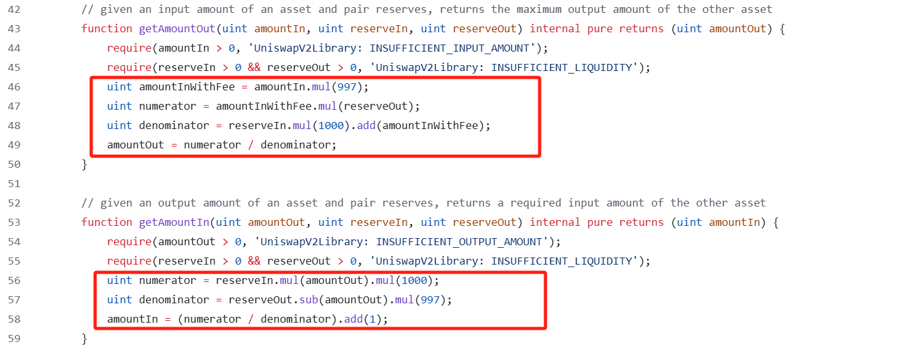
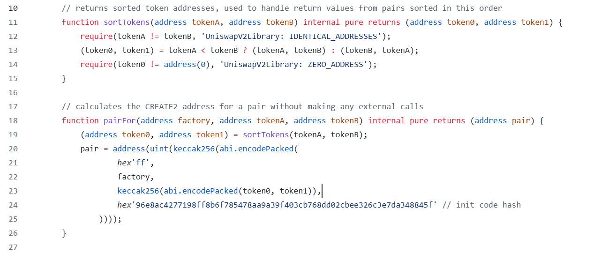
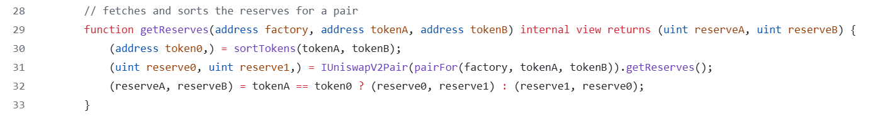
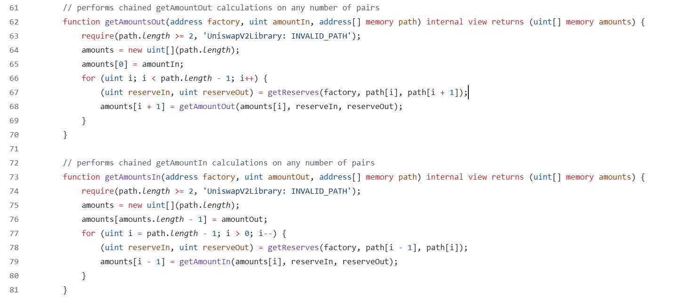

# UniswapV2Library
>`UniswapV2Library`简化了与`UniswapV2Pair`的一些交互，并被`router`合约大量使用。它包括几个重要的函数，对于在智能合约中集成UniswapV2也很方便。

### getAmountOut和getAmountIn

如果我们想预测如果我们提供固定数量的代币X，将获得的代币y数量，可以通过`getAmountOut`函数，红框中的代码实现了在`swap`章节推导的公式。`getAmountIn`则是反向操作。

### sortTokens和pairFor

- `sortTokens`实现了按照给定任意交易对的两种token的地址，按照地址大小排序。  
- `pairFor` 实现了给定创建pair工厂合约，任意交易对的两种token的地址，可以计算出其pair合约的地址，计算规则和工厂合约中`create2`方式创建pair的规则是一样的。

### getReserves

`getReserves`调用了`sortTokens`和`pairFor`方法，并包装pair合约的查询储备金方法，实现了给定任意交易对的两种token地址，可以查询出这个交易对的储备金。

### getAmountsOut和getAmountsIn

- `path`参数接收一个token地址的数组，类似于`[a,b,c,d]`。用户可以转入a，最终得到d，这种swap跨越了多个池子。
- 通过调用上面的方法，可以查询出(a,b),(b,c),(c,d)这三个池子的储备金额，并依次算出每种token（包含输入token）的数量，保存到数组并返回，以便下一步依次调用UniswapV2Pair种的swap方法。
- 智能合约并不能自行计算出货币对的最佳顺序，只是根据用户传进来的参数执行。这一步需要用户自己计算，且最好在链下完成。

