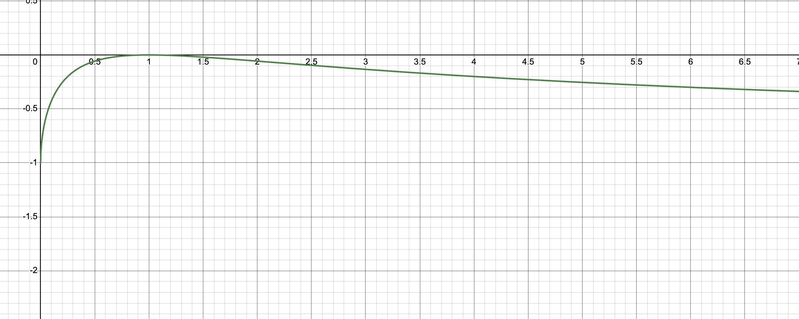
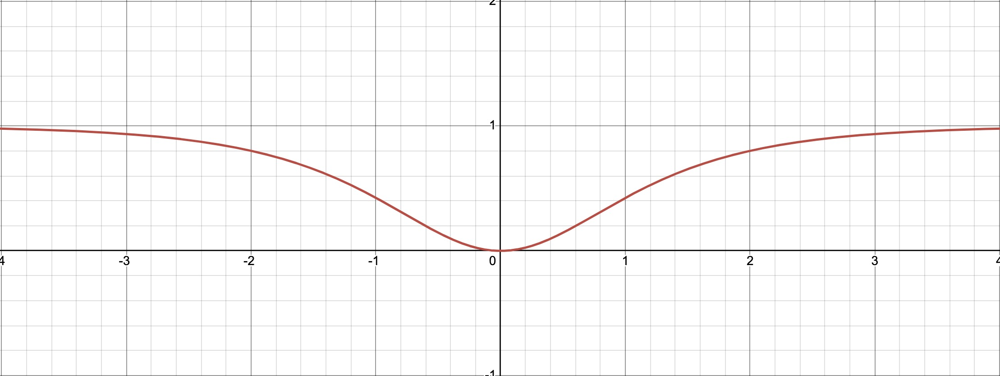

# Uniswap V2 Impermanent Loss

### 什么是无常损失？

无常损失，是指当池子资产价格发生波动时，AMM 会强制重新配比你的资产，这会导致“机会成本”上的损失。也就是 LP 的代币总价值会小于只是单独持有这些代币时的总价值。

### 举例：

在一个 ETH/USDC 的交易对中，池子当时的价格为 100 USDC/ETH ，LP 添加了 1 ETH 和 100 USDC 进入流动性池

这部分流动性为： $\sqrt{1 \cdot 100} = 10$

此时 LP 拥有的价值为：200 USDC

- **ETH 增值**

  ETH 增值到 156.25 USDC/ETH

  由于 LP 的流动性不变， $\sqrt{ 0.8 * 125} = 10$

  此时 LP 拥有代币的数量为 ：$0.8 ETH + 125 USDC$

  LP 拥有的价值： $0.8 \cdot 156.25 + 125 = 250 U$

  假设 LP 最初没有添加流动性，而是持有这些代币，那么此时这些代币的总价值为：$1 \cdot 156.25 + 100 = 256.25 U$
  **添加流动性比不添加流动性少赚了 ：256.25 - 250 = 6.25 U**

- **ETH 贬值**

  ETH 贬值到：64 USDC/ETH

  由于 LP 流动性不变， $\sqrt{1.25 * 80} = 10$

  此时 LP 拥有的代币数量为： $1.25 ETH + 80 USDC$

  LP 拥有的价值： $1.25 \cdot 64 + 80 = 160 U$

  假设 LP 最初没有添加流动性，而是持有这些代币，那么此时这些代币的总价值为：$1 \cdot 64 + 100 = 164 U$
  **添加流动性比不添加流动性多亏了： 164 - 160 = 4 U**

💡 从上面的例子可以看出来，无论价格是涨还是跌，AMM 都会重新配比 LP 的资产，无常损失也是无法避免的。所以 协议会用手续费来补偿这部分亏损。

### 数学模型

假设现在有一个交易对，其中两种 token 的数量分别是$x$,$y$，价格为$p$，$k$的平方根$L$：

$$
p = \frac{y}{x}
$$

$$
L = \sqrt{x \cdot y}
$$

由上面两个公式很容易得出：

$$
y = L \cdot \sqrt{p}
$$

$$
x = \frac{L}{\sqrt{p}}
$$

假设在$t_0$时刻的价格为$p_0$，$t_1$时刻的价格为$p_1$，$p_0$和$p_1$的变化关系$p_1 = p_0 \cdot d$

**如果用户在$t_0$时刻持有 token，在$t_1$时刻持有这些 token 的价值为$v_{hold}$:**

$$
\begin{aligned}
v_{hold} &= y_0 + x_0 \cdot p_1 \\
         &= L \cdot \sqrt{p_0} + \frac{L}{\sqrt{p_0}} \cdot p_0 \cdot d \\
         &= L \cdot \sqrt{p_0} + L \cdot \sqrt{p_0} \cdot d \\
         &= (1 + d) \cdot L \cdot \sqrt{p_0}
\end{aligned}
$$

**如果用户在$t_0$时刻将 token 添加流动性，在$t_1$时刻持有这些 token 的价值为$v_1$:**

$$
\begin{aligned}
v_1 &= y_1 + x_1 \cdot p_1 \\
    &= L \cdot \sqrt{p_1} + \frac{L}{\sqrt{p_1}} \cdot p_1 \\
    &= 2 \cdot L \cdot \sqrt{p_1} \\
    &= 2 \cdot L \cdot \sqrt{p_0 \cdot d}

\end{aligned}
$$

**用户的无常损失 IL 为:**

$$
\begin{aligned}
IL &= \frac{v_1 - v_{hold}}{v_{hold}} \\
   &= \frac{2 \cdot L \cdot \sqrt{p_0 \cdot d} - (1 + d) \cdot L \cdot \sqrt{p_0}}{(1 + d) \cdot L \cdot \sqrt{p_0}} \\
   &= \frac{2 \cdot \sqrt{d}}{1 + d} - 1

\end{aligned}
$$

下图为无常损失 $IL(d) = \frac{2 \cdot \sqrt{d}}{1 + d} - 1$ 函数的曲线：

**函数的对称性**

该函数具有倒数的对称性，也就是 $IL(d) = IL(\frac{1}{d})$，证明如下：

$$
\begin{aligned}
IL\left(\frac{1}{d}\right)
&= \frac{2 \cdot \sqrt{\frac{1}{d}}}{1 + \frac{1}{d}} - 1\\[8pt]
&= \frac{2 \cdot \frac{1}{\sqrt{d}}}{\frac{r + 1}{d}} - 1\\[8pt]
&= \frac{2}{\sqrt{d}} \cdot \frac{d}{d + 1} - 1\\[8pt]
&= \frac{2 \sqrt{d}}{d + 1} - 1\\[8pt]
&= IL(d)
\end{aligned}
$$

由于这个性质，我们可以引入对数变量，令 $r = \log_{10}(d)$，将上面函数改写为：

$$
IL(r) = \frac{2\sqrt{10^r}}{1 + 10^r} - 1
$$

该函数的曲线为下图：

从上图我们可以清晰的发现无常损失函数的两个特征：

- **对称性**，函数关于 $r = 0$对称，涨跌同等倍数的价格变动，会导致相同的无常损失，例如$r = 1$,也就是价格涨了 10 倍，其无常损失等于$r = -1$,价格跌到原价的十分之一。
- **非负性**，无论价格如何变化，提供流动性的用户永远不回超过“单纯持有资产”的收益。
- **凸性**，函数在对数坐标系是近似凸的，随着价格波动幅度增大，无常损失增长加速。
