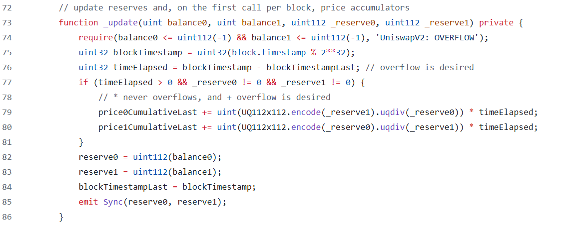

# Uniswap V2 Oracle

> 价格预言机是价格的来源，uniswap 的池子在持有两种 token 时，其余额的比例正好是价格，其他智能合约可以通过和 uniswap 池子合约交互，轻松从链上获取价格。

## TWAP

如果使用当前余额比例来确定价格会有什么问题？如果有人使用闪电贷进行巨额交易，从而大幅改变池子资产比例，导致价格暂时大幅度波动，然后利用另外一个使用该价格进行决策的智能合约获利。所以 uniswap 提供了一种 TWAP（Time-Weighted Average Price）的机制，价格消费者可以取某一个时间段内的价格的平均值来确定价格，这使得如果有人想操纵价格，必须在几个区块内都进行交易，使得攻击成本大幅提高。

### 数学计算

TWAP，时间加权平均价格，是通过“时间”这个纬度，将每个价格按它在时间中的长度加权平均。

举例说明：

- 在过去一天，价格在前 12 个小时内为 10 美元，在后 12 个小时内为 11 美元，其时间加权平均价格为 $\frac{(10 \cdot 12) + (11 \cdot 12)}{12 + 12} = 10.5$
- 在过去一天，价格在前 22 个小时内为 10 美元，在后 2 个小时内为 11 美元，其时间加权平均价格为$\frac{(10 \cdot 22) + (11 \cdot 2)}{22 + 2} = 10.083$

如果设价格为$P$,时间长度为$T$,则 TWAP 的公式为：

$$
\frac{P_1 T_1 + P_2 T_2 + \cdots + P_n T_n}{\sum_{i=1}^{n} T_i}
$$

## 代码解析



**从上面的公式可以看到，我们需要在每次价格变化时，累计持续时间和价格的乘积。那么 uniswap 是怎么做的呢？**

- 在 uniswap 中，价格的变化意味着池子中资产比率发生了变化，`_update`是在每次`mint`,`burn`,`swap`时更改池子资产数量，所以可以在这里累计每一次价格
- `blockTimestampLast`记录了上一次累计价格的时间戳。计算两次变化的间隔时间：`timeElapsed = blockTimestamp - blockTimestampLast`。值得注意的是，`blockTimestamp`是区块的时间戳，也就是说，同一区块内当多次调用`_update`函数时，只有第一次才会累计价格。这意味着攻击者想操纵价格，必须不断的操纵多个区块的第一笔交易，这基本是不可能实现的。
- 价格累计的值`price0CumulativeLast`和`price1CumulativeLast`是 uint 类型，一个 slot 是 32 个字节，也就是他们最大可以表示为
  $2^{256} - 1$。当超过这个值时，会发生溢出。uniswapV2 是 solidity0.8 之前的版本实现，不会因为溢出而 revert，只从零开始计算。
  - 假设，token0 上一次累计的价格是$2^{256} - 10$，当前累计价格是$2^{256} + 10$。从数学运算上讲，他们的差值是 20。
  - 但是实际上当前累计价格因为溢出，会记录为 10。实际计算：$10 - (2^{256} - 10)$，结果为$-2^{256} + 20$。由于 uint 类型是无符号整数，所以最后结果还是 20，符合数学运算的结果。
- `UQ112x112.encode(_reserve1).uqdiv(_reserve0)`，因为 solidity 除法的舍入阶段问题，这里计算资产比率时，使用了定点运算的方式，精度是 2 ^ 112。

**从上面代码可以看到 uniswapV2 的代码中，只是不停的记录了累计价格，那我们怎么计算我们想要的平均价格呢？**

由于这个累计价格是从池子初始化开始就一直累计的，如果我们想获取任意一段时间$t_{n-1}$到$t_n$的加权平均价格，假设$t_{n-1}$时的累计价格为$p_{n-1}$,$t_n$时的累计价格为$p_n$,则可以通过下面这个公式：

$$
\frac{p_n - p_{n-1}}{t_n - t_{n-1}}
$$

从上面公式可以发现，我们只需要按照我们需要的时间点去获取两个时间点累计价格的快照，就可以算出平均价格。也就是定时读取`uniswapV2Pair`的存储变量`price0CumulativeLast`或`price1CumulativeLast`。

**如果最后一次快照是三小时之前的快照怎么办？**
在上面的合约中如果，在三小时内`_update`函数没有被`mint`,`burn`,`swap`调用，则无法快照。`uniswapV2Pair`提供了另外一个函数，让我们手动去调用：

```solidity
function sync() external lock {
    _update(IERC20(token0).balanceOf(address(this)), IERC20(token1).balanceOf(address(this)), reserve0, reserve1);
}
```

**为什么 TWAP 分别跟踪两种 token 的累计价格？**

token0 的价格实际上是 token1 的数量和 token0 数量的比率，反之亦然。实际上两种价格就是分子和分母颠倒的数字。但是当我们累计价格时，就不能通过反转其中一个累计价格来获得另外一个累计价格了，比如：

- token0 的累计价格：$2 + 3$
- token1 反转后：$\frac{1}{2 + 3}$
- token1 实际的累计价格：$\frac{1}{2} + \frac{1}{3}$
