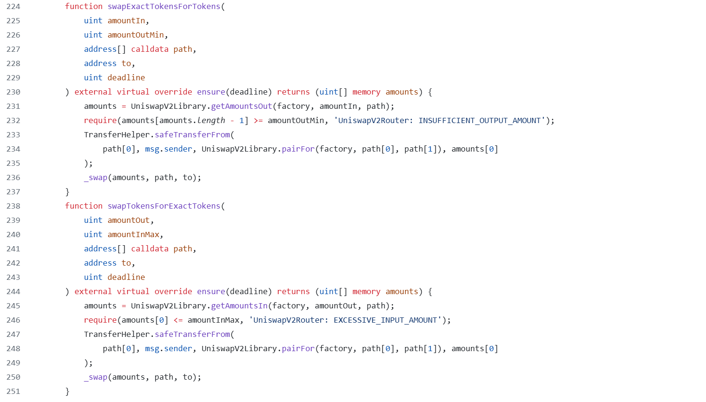
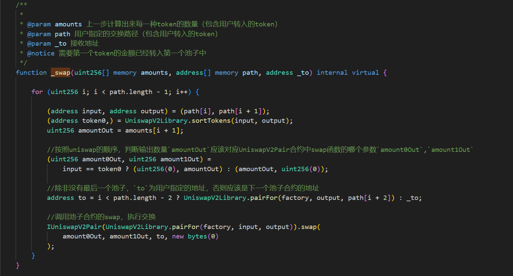
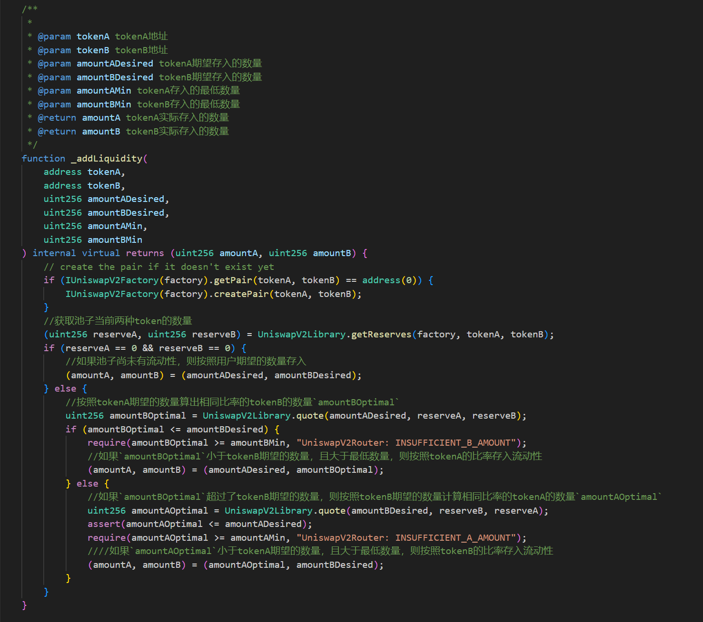
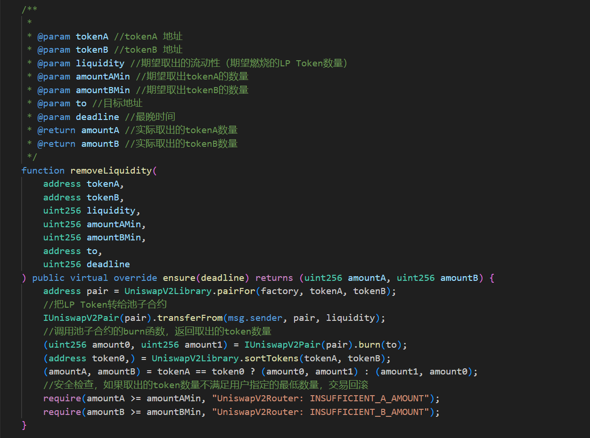

# UniswapV2 router

> `periphery`中提供了两个重要的合约`UniswapV2Router01`和`UniswapV2Router02`。其中后者继承了前者，并增加了对 fee on transfer token 的支持。

## router 合约是面向用户的合约，用于

- 安全的添加和移除流动性
- 安全的 swap
- 添加了`core`合约中省略的与滑点相关的安全检查
- 通过与`WETH`合约集成，增加交换以太币的能力
- 增加了对`Fee on Transfer Tokens`的支持

## swapExactTokensForTokens 和 swapTokensForExactTokens



### 参数

- `swapExactTokensForTokens`：意味者正在交换的输入 token 的数量是固定的。用户需要准确指定将要存入的 token 的数量`amountIn`。接受的输出 token 的最低数量`amountOutMin`。
- `swapTokensForExactTokens`：意味者接收的输出 token 的数量是固定的。用户需要准确指定想要接收的 token 的数量`amountOut`。需要存入的 token 的最大数量`amountInMax`。
- `path`：用户可以指定需要交换的 token 路径，可以跨越多个池子。
- `to`：接收地址
- `deadline`:最晚时间

### 代码解析

```solidity
amounts = UniswapV2Library.getAmountsOut(factory, amountIn, path);
require(amounts[amounts.length - 1] >= amountOutMin, 'UniswapV2Router: INSUFFICIENT_OUTPUT_AMOUNT');
```

当调用`swapExactTokensForTokens`时，首选会根据入参计算单个 swap 或跨越多个池子的 swap 预期的输出，如果预期的输出低于用户指定的最低输出，函数将 revert。对于`swapTokensForExactTokens`，计算所需的输入，如果高于用户指定的最大输入数量，则 revert。

```solidity
TransferHelper.safeTransferFrom(
    path[0], msg.sender, UniswapV2Library.pairFor(factory, path[0], path[1]), amounts[0]
);
_swap(amounts, path, to);
```

- 然后这两个函数都会将用户的 token 转入到`path`中第一个池子中去。在`UniswapV2Pair`中的`swap`函数要求用户要先把 token 转账到池子合约中去。
- 最后他们都调用了`_swap`函数。



## \_addLiquidity

在 mintAndburn 章节，我们提到过流动性安全检查。具体来说，我们希望确保存入的两种 token 数量与池子中的 token 余额比率是相同的，否则，我们获得的 LP Token 数量是存入的数量和池子余额两个比率中最小的那个。但是在 LP 发起添加流动性交易和交易被确认之间，池子中资产会发生变化。router 中提供了`_addLiquidity`函数可以为 LP 提供必要的流动性安全检查。



## removeLiquidity

移除流动性会燃烧 LP Token，如果 token 比率在 LP 发起移除流动性交易和交易被确认之间发生剧烈变化，那么 LP 将无法取回他们预期的 token 数量。router 中提供了`removeLiquidity`函数可以为 LP 提供必要的安全检查。



## 对`Fee on Transfer Tokens`的支持

在 UniswapV2 中，处理`Fee on Transfer Tokens`时需要进行特殊处理，因为这些 token 在每次转账的时候会扣除一部分费用，不能直接对用户输入的 token 数量等参数进行计算。在 swap 和 removeLiquidity 时会涉及到这种情况，addLiquidity 不受影响，用户实际转入多少，就记多少。
