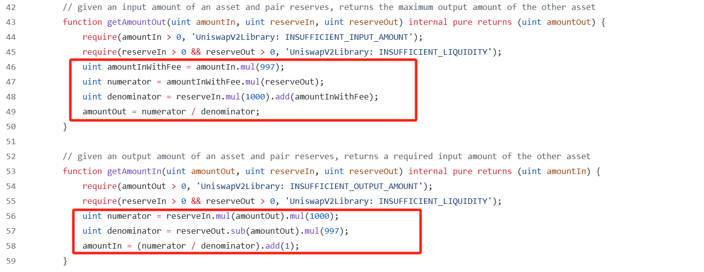
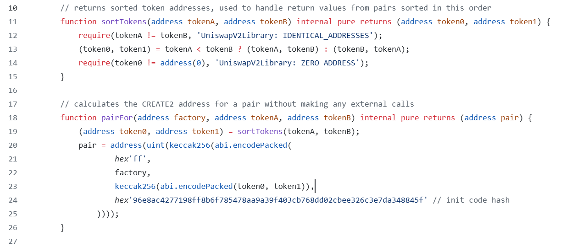
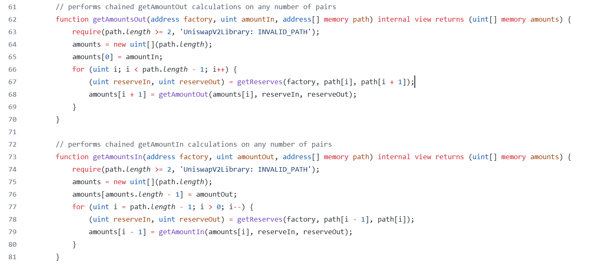

# UniswapV2Library

> `UniswapV2Library`简化了与`UniswapV2Pair`的一些交互，并被`router`合约大量使用。它包括几个重要的函数，对于在智能合约中集成 UniswapV2 也很方便。

### getAmountOut 和 getAmountIn

如果我们想预测如果我们提供固定数量的代币 X，将获得的代币 y 数量，可以通过`getAmountOut`函数，红框中的代码实现了在`swap`章节推导的公式。`getAmountIn`则是反向操作。

### sortTokens 和 pairFor

- `sortTokens`实现了按照给定任意交易对的两种 token 的地址，按照地址大小排序。
- `pairFor` 实现了给定创建 pair 工厂合约，任意交易对的两种 token 的地址，可以计算出其 pair 合约的地址，计算规则和工厂合约中`create2`方式创建 pair 的规则是一样的。

### getReserves

`getReserves`调用了`sortTokens`和`pairFor`方法，并包装 pair 合约的查询储备金方法，实现了给定任意交易对的两种 token 地址，可以查询出这个交易对的储备金。

### getAmountsOut 和 getAmountsIn

- `path`参数接收一个 token 地址的数组，类似于`[a,b,c,d]`。用户可以转入 a，最终得到 d，这种 swap 跨越了多个池子。
- 通过调用上面的方法，可以查询出(a,b),(b,c),(c,d)这三个池子的储备金额，并依次算出每种 token（包含输入 token）的数量，保存到数组并返回，以便下一步依次调用 UniswapV2Pair 种的 swap 方法。
- 智能合约并不能自行计算出货币对的最佳顺序，只是根据用户传进来的参数执行。这一步需要用户自己计算，且最好在链下完成。
