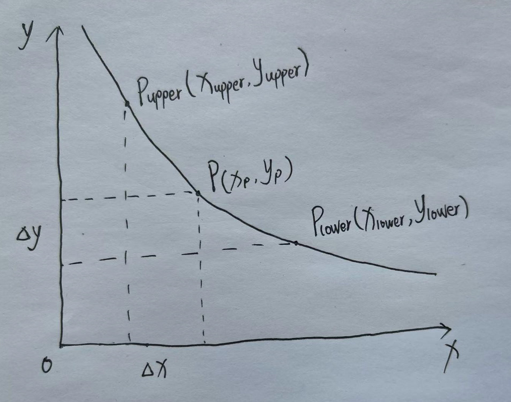
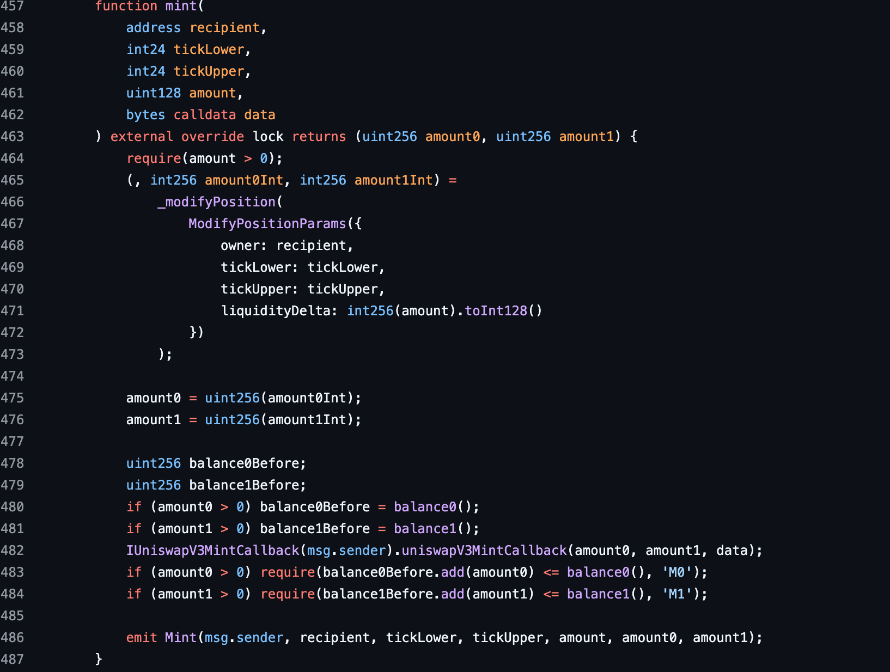
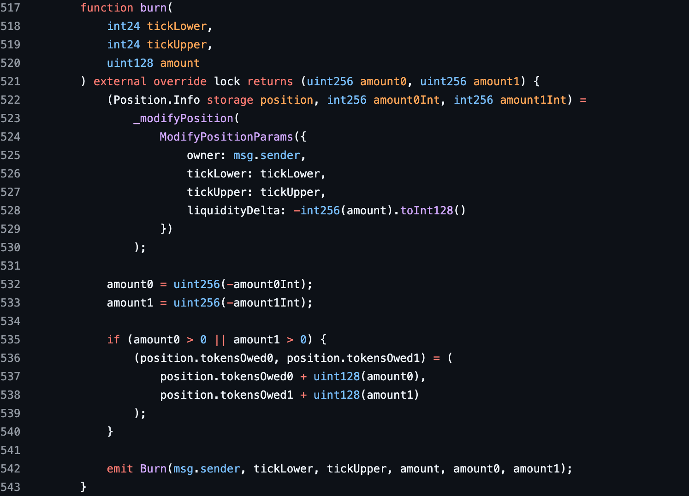
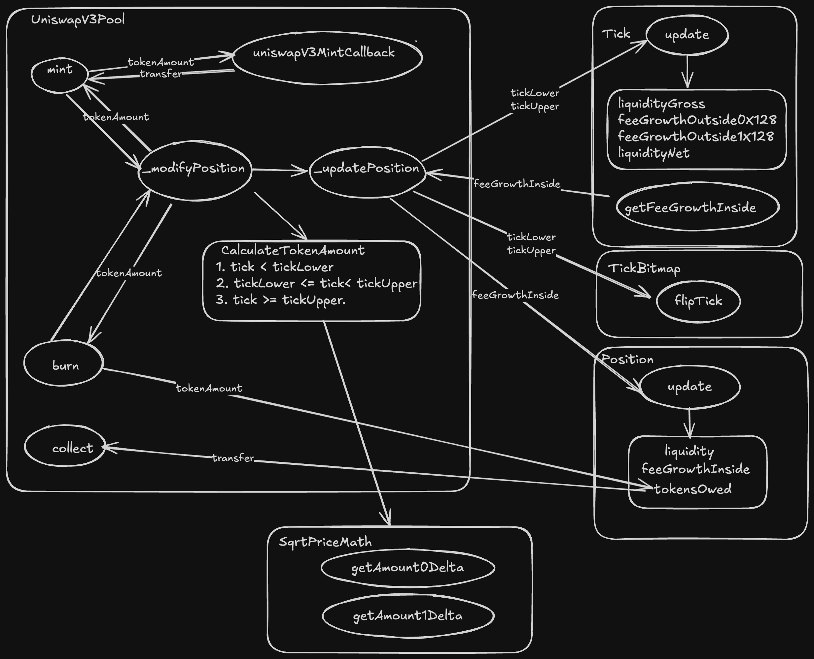

# Uniswap V3 Mint & Burn

## uniswapV2 和 V3 的区别

**V2: 全区间，统一池，被动参与**

- LP 的添加的流动性都被平均分布在整个价格区间 $(0,\infty)$ 。无论当前市场价格处于那个位置，LP 的资金总是会参与报价。
- 所有资金都放在一个共享的大池子中，添加新的流动性只需要按照当前市场价格比例，等值提供两种 token。

因此，V2 中的流动性可以直接根据 LP 添加的 token 数量来计算。

**V3: 指定价格区间，多池，主动控制**

- LP 不再被迫提供全区间流动性，可以指定在特定价格区间提供流动性，每个价格区间都有自己的价格曲线，流动性计算也是独立的。只有当市场价格在该价格区间运行时，LP 的资金才会参与报价。
- 当在非活跃价格区间提供流动性，只需提供其中一种 token，也就是可以提供单边流动性。

因此在 V3 中流动性计算不单单决定于 token 数量，而是由 token 数量和 LP 指定的价格区间和当前市场价格共同决定的。

**Uniswap V2 的流动性分布是全局的，被动的，而 V3 的流动性是主动部署的局部资产，其计算逻辑也随之从“比例确定”转变为“价格区间，token 数量，当前市场价格”的函数关系。**

## 数学模型



假设存在交易对 (x,y)，LP 设定添加流动性的区间为 $[P_{lower},P_{upper}]$ , 当前市场价格为 $P$ , 在 $P$ 点的真实流动性为 $\Delta x$ , $\Delta y$ 。然后我们分析以下三种情况：

1. **$P_{lower}<P<P_{upper}$**

   当前市场价格位于这个价格区间内时，我们可以发现从$P$到$P_{lower}$这段价格曲线的流动性实际上是由资产 y 支撑的，因为价格从$P$到$P_{lower}$消耗的是池子中资产 y。$P$到$p_{upper}$的流动性是由资产 x 支撑的，价格从$P$到$P_{upper}$消耗的是池子中资产 x。然后计算$\Delta x$ 和 $\Delta y$：

$$
\Delta x = x_p - x_{upper} = \frac{L}{\sqrt{P}} - \frac{L}{\sqrt{P_{upper}}} = L(\frac{1}{\sqrt{P}} - \frac{1}{\sqrt{P_{upper}}})\\
\Delta y = y_p - y_{lower} = L \cdot \sqrt{P} - L \cdot \sqrt{p_{lower}} = L(\sqrt{P} - \sqrt{P_{lower}})
$$

根据上面的公式，可以反推出 L：

$$
L = \frac{\Delta x \cdot \sqrt{P} \cdot \sqrt{P_{upper}}}{\sqrt{P} - \sqrt{P_{upper}}} \\
L = \frac{\Delta y}{\sqrt{P} - \sqrt{P_{lower}}}
$$

2. **$P>= P_{upper}$**

   当前市场价格大于等于这个价格区间的上边界时，此时在这个区间添加的流动性处于非活跃状态，不会参与当前市场的撮合。只有当前市场价格持续下跌至$[P_{upper},P_{lower}]$区间时才会被激活，从$P_{upper}$到$P_{lower}$这段价格曲线的流动性是由资产$y$支撑的，计算价格从$P_{upper}$下跌到$P_{lower}$消耗池子中资产 y 的数量$\Delta y$：

$$
 \Delta y = y_{upper} - y_{lower} = L \cdot \sqrt{P_{upper}} - L \cdot \sqrt{P_{lower}} = L(\sqrt{P_{upper}} - \sqrt{P_{lower}})
$$

反推 L：

$$
L = \frac{\Delta y}{\sqrt{P_{upper}} - \sqrt{P_{lower}}}
$$

3. **$P<= P_{lower}$**

   当前市场价格小于等于这个价格区间的下边界时，同理，只有市场价格上涨至$[P_{lower},P_{upper}]$区间内才会被激活，而从$P_{lower}$到$P_{upper}$这段价格曲线的流动性是由资产 x 支撑的，计算价格从$P_{lower}$上涨到$P_{upper}$消耗池子中资产 x 的数量$\Delta x$:

$$
\Delta x = x_{lower} - x_{upper} = \frac{L}{\sqrt{P_{lower}}} - \frac{L}{\sqrt{P_{upper}}} = L(\frac{1}{\sqrt{P_{lower}}} - \frac{1}{\sqrt{P_{upper}}})
$$

反推 L：

$$
L = \frac{\Delta x \cdot \sqrt{P_{lower}} \cdot \sqrt{P_{upper}}}{\sqrt{P_{upper}} - \sqrt{P_{lower}}}
$$

利用上面的公式，我们就可以计算 LP 添加的 token 的数量对应的流动性了，因为$P$，$[P_{lower},P_{upper}]$，要添加的资产数量$\Delta x$,$\Delta y$都是已知的。

- 先看第一种情况，当添加的价格区间是当前市场价格活跃的区间时，我们可以看到添加两种 token 会计算出两个 L，那么实际上 uniswapV3 要使用哪个呢？答案是小的那个，因为在用户添加了流动性后，我们要构造一个新的价格曲线，如果两边的 L 不同，那么就不是一条连续的价格曲线。如果取大的那个，就会导致小的那个 L 那边支撑的那种资产不足以支撑其流动性。而取小的那个，可以反过来推算出支撑另一边的流动性需要的资产数量，然后将多余的 token 退还给用户即可。
- 第二和第三种情况本质上是一样的，当添加的价格区间是当前市场价格非活跃的区间时，我们可以看到 LP 只需要添加其中一种 token，也就是所谓的单边流动性，只有当市场价格进入此区间内，该流动性才会被使用到。

## 源码实现

### Position

在 tick 章节，我们学习了 uniswapV3 是如何记录和计算各个区间的流动性和手续费的。那么系统是如何记录 LP 的头寸和手续费收益呢？下面看`position`这个库是如何实现的。

#### Position.info

```solidity
struct Info {
    uint128 liquidity; // 该 position 当前的流动性
    uint256 feeGrowthInside0LastX128;
    uint256 feeGrowthInside1LastX128;
    uint128 tokensOwed0; // 尚未领取的 token0 手续费
    uint128 tokensOwed1; // 尚未领取的 token1 手续费
}
```

- feeGrowthInside0LastX128/feeGrowthInside1LastX128

  这两个字段的定义是：距离上次操作时此 position 已经累计的“每单位流动性产生的累计手续费”，所以如果要计算这次操作期间 LP 应得多少手续费，只需要：$(feeGrowthInsideNow - feeGrowthInsideLast) * liquidity$

- tokensOwed0/tokensOwed1

  已经计算出来但 LP 尚未领取的手续费，累加在这里。

#### get

```solidity
function get(
    mapping(bytes32 => Info) storage self,
    address owner,
    int24 tickLower,
    int24 tickUpper
) internal view returns (Position.Info storage position) {
    position = self[keccak256(abi.encodePacked(owner, tickLower, tickUpper))];
}
```

- 参数`mapping(bytes32 => Info) storage self` 是存放了所有 position 的映射表
- 每个 position 都可以通过 LP 地址（owner），tickLower，tickUpper 生成的唯一标识来确定，也就是对这三个信息编码后去哈希确定在 self 中 key：`keccak256(abi.encodePacked(owner, tickLower, tickUpper))`

#### update

这个函数是`Position`的核心逻辑，它主要处理了一个 LP 头寸在添加或移除流动性或累积手续费时，内部状态是如何更新的。

```solidity
function update(
    Info storage self,
    int128 liquidityDelta, //流动性变化量
    uint256 feeGrowthInside0X128, //当前tick区间的手续费累积值
    uint256 feeGrowthInside1X128
) internal {
    // 拷贝一份 position 的旧状态（避免直接操作 storage）
    Info memory _self = self;

    uint128 liquidityNext;
    if (liquidityDelta == 0) {
        // 情况一：只更新手续费，不改变流动性（poke 操作）
        // 但是必须保证这个头寸存在（liquidity > 0），否则报错 "NP"
        require(_self.liquidity > 0, 'NP');
        liquidityNext = _self.liquidity;
    } else {
        // 情况二：LP 增加或减少流动性
        // 调用 LiquidityMath.addDelta 来更新流动性（自动处理正负数）
        liquidityNext = LiquidityMath.addDelta(_self.liquidity, liquidityDelta);
    }

    // ================================
    // 计算自上次更新以来新增长的手续费
    // ================================

    // feeGrowthInside0X128 - _self.feeGrowthInside0LastX128
    // → 表示 LP 这个区间在 token0 上新增长的 fee（per liquidity）
    // 乘以 LP 的 liquidity → 得到 LP 新增的 token0 数量
    // 再除以 Q128（因为是 Q128.128 定点数）→ 转为整数
    uint128 tokensOwed0 =
        uint128(
            FullMath.mulDiv(
                feeGrowthInside0X128 - _self.feeGrowthInside0LastX128,
                _self.liquidity,
                FixedPoint128.Q128
            )
        );

    // 同理计算 token1 的新增手续费
    uint128 tokensOwed1 =
        uint128(
            FullMath.mulDiv(
                feeGrowthInside1X128 - _self.feeGrowthInside1LastX128,
                _self.liquidity,
                FixedPoint128.Q128
            )
        );

    // ================================
    // 更新 position 的状态
    // ================================

    // 如果 liquidityDelta ≠ 0，说明有增减流动性 → 写回 storage
    if (liquidityDelta != 0) self.liquidity = liquidityNext;

    // 更新 feeGrowthInside 的快照
    // 这样下次再调用 update 时，就能算新增手续费
    self.feeGrowthInside0LastX128 = feeGrowthInside0X128;
    self.feeGrowthInside1LastX128 = feeGrowthInside1X128;

    // 如果算出的 tokensOwed 大于 0，就累加到 position 上
    // 注意：这里只是记账，不会立即转账
    if (tokensOwed0 > 0 || tokensOwed1 > 0) {
        // 允许溢出（只要 LP 在 type(uint128).max 前取出即可）
        self.tokensOwed0 += tokensOwed0;
        self.tokensOwed1 += tokensOwed1;
    }
}
```

总结，`update`主要干了三件事：

1. 更新流动性
   - 如果有`liquidityDelta`，改`liquidity`
   - 如果只是 poke，维持原状
2. 更新手续费
   - 用（当前 feeGrowthInside - 上次记录的 feeGrowthInside）x liqudity 计算两次操作时间段的手续费
   - 把这部分手续费存到`tokenOwed`
3. 更新快照
   - 把`feeGrowthInsideLastX128`更新为最新全局值，确保下次计算手续费正确

所以本质上，`update`是`position`的记账逻辑，保证 position 的流动性和手续费状态始终是最新且正确的。

### UniswapV3Pool.\_modifyPosition

在学习`mint`,`burn`之前，我们先学习，`UniswapV3Pool._modifyPosition`这个内部函数，它是 uniswapV3 处理添加移除流动性的核心部分，也被`mint`和`burn`调用。

```solidity
function _modifyPosition(ModifyPositionParams memory params)
    private
    noDelegateCall
    returns (
        Position.Info storage position,
        int256 amount0,
        int256 amount1
    )
{
    // 1. 校验 tick 合法性（保证 tickLower < tickUpper 且符合 tickSpacing）
    checkTicks(params.tickLower, params.tickUpper);

    // 读取 slot0 缓存，减少 SLOAD
    Slot0 memory _slot0 = slot0;

    // 2. 更新 position 和 tick 信息
    position = _updatePosition(
        params.owner,
        params.tickLower,
        params.tickUpper,
        params.liquidityDelta,
        _slot0.tick
    );

    if (params.liquidityDelta != 0) {
        // 3. 根据当前价格与 tick 区间的关系分三种情况计算 token 数量

        if (_slot0.tick < params.tickLower) {
            // 当前价格在区间下方：只需计算 token0
            amount0 = SqrtPriceMath.getAmount0Delta(
                TickMath.getSqrtRatioAtTick(params.tickLower),
                TickMath.getSqrtRatioAtTick(params.tickUpper),
                params.liquidityDelta
            );

        } else if (_slot0.tick < params.tickUpper) {
            // 当前价格在区间内：计算 token0 和 token1
            uint128 liquidityBefore = liquidity; // 缓存全局流动性

            // 4. 写入 Oracle 观察值 暂且跳过
            (slot0.observationIndex, slot0.observationCardinality) = observations.write(
                _slot0.observationIndex,
                _blockTimestamp(),
                _slot0.tick,
                liquidityBefore,
                _slot0.observationCardinality,
                _slot0.observationCardinalityNext
            );

            // 计算 token 数量
            amount0 = SqrtPriceMath.getAmount0Delta(
                _slot0.sqrtPriceX96,
                TickMath.getSqrtRatioAtTick(params.tickUpper),
                params.liquidityDelta
            );
            amount1 = SqrtPriceMath.getAmount1Delta(
                TickMath.getSqrtRatioAtTick(params.tickLower),
                _slot0.sqrtPriceX96,
                params.liquidityDelta
            );

            // 5. 更新全局 liquidity
            liquidity = LiquidityMath.addDelta(liquidityBefore, params.liquidityDelta);

        } else {
            // 当前价格在区间上方：只需计算 token1
            amount1 = SqrtPriceMath.getAmount1Delta(
                TickMath.getSqrtRatioAtTick(params.tickLower),
                TickMath.getSqrtRatioAtTick(params.tickUpper),
                params.liquidityDelta
            );
        }
    }
}
```

#### 1.Solt0

`Solt0`是`UniswapV3Pool`中定义的一个结构体，也是每个池子合约第一个 solt 中存储的池子全局状态的信息。我们这里主要用到了`sqrtPriceX96`,`tick`,其他的会在其他章节学习。

```solidity
struct Slot0 {
    uint160 sqrtPriceX96;           // 当前价格的平方根，Q64.96 定点数
    int24 tick;                     // 当前价格对应的 tick
    uint16 observationIndex;        // 最新一次观察值在 observations 数组中的索引
    uint16 observationCardinality;  // observations 数组的有效长度
    uint16 observationCardinalityNext; // 下次扩容后的长度
    uint8 feeProtocol;              // 协议手续费分成
    bool unlocked;                  // 池子是否解锁，防止 reentrancy
}
```

#### 2.\_updatePosition

`_updatePosition`的逻辑主要是更新上下边界 tick 的状态，LP 的头寸 position 的状态。

```solidity
function _updatePosition(
    address owner,
    int24 tickLower,
    int24 tickUpper,
    int128 liquidityDelta,
    int24 tick
) private returns (Position.Info storage position) {
    // 1️⃣ 获取 LP 在 tickLower 和 tickUpper 区间的 position
    position = positions.get(owner, tickLower, tickUpper);

    uint256 _feeGrowthGlobal0X128 = feeGrowthGlobal0X128; // 当前池子 token0 全局手续费
    uint256 _feeGrowthGlobal1X128 = feeGrowthGlobal1X128; // 当前池子 token1 全局手续费

    bool flippedLower;
    bool flippedUpper;

    if (liquidityDelta != 0) {
        uint32 time = _blockTimestamp();

        // 2️⃣ 预言机部分 暂且跳过
        (int56 tickCumulative, uint160 secondsPerLiquidityCumulativeX128) =
            observations.observeSingle(
                time,
                0,
                slot0.tick,
                slot0.observationIndex,
                liquidity,
                slot0.observationCardinality
            );

        // 3️⃣ 更新下边界 tick 的状态
        flippedLower = ticks.update(
            tickLower,              // tick 下边界
            tick,                   // 当前价格所在 tick
            liquidityDelta,         // 增加或减少的流动性
            _feeGrowthGlobal0X128,  // 全局 token0 手续费
            _feeGrowthGlobal1X128,  // 全局 token1 手续费
            secondsPerLiquidityCumulativeX128,
            tickCumulative,
            time,
            false,                  // 是否为上边界 tick
            maxLiquidityPerTick
        );

        // 4️⃣ 更新上边界 tick 的状态
        flippedUpper = ticks.update(
            tickUpper, tick, liquidityDelta,
            _feeGrowthGlobal0X128, _feeGrowthGlobal1X128,
            secondsPerLiquidityCumulativeX128, tickCumulative,
            time,
            true,                   // 上边界 tick
            maxLiquidityPerTick
        );

        // 5️⃣ 如果 tick 状态从未初始化 -> 已初始化或反转，更新 tickBitmap
        if (flippedLower) tickBitmap.flipTick(tickLower, tickSpacing);
        if (flippedUpper) tickBitmap.flipTick(tickUpper, tickSpacing);
    }

    // 6️⃣ 计算区间 [tickLower, tickUpper] 内手续费累积
    (uint256 feeGrowthInside0X128, uint256 feeGrowthInside1X128) =
        ticks.getFeeGrowthInside(tickLower, tickUpper, tick, _feeGrowthGlobal0X128, _feeGrowthGlobal1X128);

    // 7️⃣ 更新 position 的流动性和手续费状态
    position.update(liquidityDelta, feeGrowthInside0X128, feeGrowthInside1X128);

    // 8️⃣ 清理 tick 数据（当流动性减少到 0 且 tick 被翻转时）
    if (liquidityDelta < 0) {
        if (flippedLower) ticks.clear(tickLower);
        if (flippedUpper) ticks.clear(tickUpper);
    }
}
```

#### 3.根据当前价格与 tick 区间的关系分三种情况计算 token 数量

这段逻辑就是上面分析的那三种数学模型，根据当前价格所处位置，在给定流动性 $L$,价格区间$[tickLower, tickUpper]$计算所需的 token 数量，`SqrtPriceMath`是 uniswapV3 底层的数学库，我们具体来看`SqrtPriceMath.getAmount0Delta`,`SqrtPriceMath.getAmount0Delta`的源码。

```solidity
    function getAmount0Delta(
        uint160 sqrtRatioAX96,
        uint160 sqrtRatioBX96,
        int128 liquidity
    ) internal pure returns (int256 amount0) {
        return
            liquidity < 0
                ? -getAmount0Delta(sqrtRatioAX96, sqrtRatioBX96, uint128(-liquidity), false).toInt256()
                : getAmount0Delta(sqrtRatioAX96, sqrtRatioBX96, uint128(liquidity), true).toInt256();
    }

    function getAmount1Delta(
        uint160 sqrtRatioAX96,
        uint160 sqrtRatioBX96,
        int128 liquidity
    ) internal pure returns (int256 amount1) {
        return
            liquidity < 0
                ? -getAmount1Delta(sqrtRatioAX96, sqrtRatioBX96, uint128(-liquidity), false).toInt256()
                : getAmount1Delta(sqrtRatioAX96, sqrtRatioBX96, uint128(liquidity), true).toInt256();
    }
```

这两个函数分别处理了两种 token 在添加和移除流动性时需要 LP 支付或给 LP 支付的 token 数量，下面我们看看它的下层函数是具体怎么实现的。

- 计算$\Delta x$

  $$
    \Delta x = L(\frac{1}{\sqrt{P_{lower}}} - \frac{1}{\sqrt{P_{upper}}})
  $$

  当市场价格位于区间内部的时，$\sqrt{P_{lower}}$其实就是当前市场价格，然后将公式展开：

  $$
  \Delta x = \frac{L \cdot (\sqrt{P_{lower}} - \sqrt{P_{upper}})}{\sqrt{P_{lower}} \cdot \sqrt{P_{upper}}}
  $$

  下面的函数就是对这个公式的实现：

```solidity
function getAmount0Delta(
        uint160 sqrtRatioAX96,
        uint160 sqrtRatioBX96,
        uint128 liquidity,
        bool roundUp
    ) internal pure returns (uint256 amount0) {
        if (sqrtRatioAX96 > sqrtRatioBX96) (sqrtRatioAX96, sqrtRatioBX96) = (sqrtRatioBX96, sqrtRatioAX96);

        uint256 numerator1 = uint256(liquidity) << FixedPoint96.RESOLUTION;
        uint256 numerator2 = sqrtRatioBX96 - sqrtRatioAX96;

        require(sqrtRatioAX96 > 0);

        return
            roundUp
                ? UnsafeMath.divRoundingUp(
                    FullMath.mulDivRoundingUp(numerator1, numerator2, sqrtRatioBX96),
                    sqrtRatioAX96
                )
                : FullMath.mulDiv(numerator1, numerator2, sqrtRatioBX96) / sqrtRatioAX96;
    }
```

- 计算$\Delta y$

$$
\Delta y = L(\sqrt{P_{upper}} - \sqrt{P_{lower}})
$$

当市场价格位于区间内部的时，$\sqrt{P_{upper}}$其实就是当前市场价格，下面的函数就是对这个公式的实现：

```solidity
    function getAmount1Delta(
        uint160 sqrtRatioAX96,
        uint160 sqrtRatioBX96,
        uint128 liquidity,
        bool roundUp
    ) internal pure returns (uint256 amount1) {
        if (sqrtRatioAX96 > sqrtRatioBX96) (sqrtRatioAX96, sqrtRatioBX96) = (sqrtRatioBX96, sqrtRatioAX96);

        return
            roundUp
                ? FullMath.mulDivRoundingUp(liquidity, sqrtRatioBX96 - sqrtRatioAX96, FixedPoint96.Q96)
                : FullMath.mulDiv(liquidity, sqrtRatioBX96 - sqrtRatioAX96, FixedPoint96.Q96);
    }
```

> 💡 **总结：** > `_modifyPosition`主要干了三件事：更新上下界 tick 的状态，新建一个 LP 头寸或更新 LP 头寸 position 的状态，根据当前价格所处位置计算出 LP 添加或移除流动性所需的 token 数量。学习完这个函数，我们就可以学习添加移除流动性的入口`mint`,`burn`函数了。

### mint



参数:

recipient：LP 的地址，新增的 position 属于谁。

tickLower：价格区间下界。

tickUpper：价格区间上界。

amount：要添加的流动性大小（目标 L）。

data：回调参数（由调用者定义，通常给 UniswapV3MintCallback 回调时用）。

return

amount0：实际需要存入的 token0 数量。

amount1：实际需要存入的 token1 数量。

`_modifyPosition` 返回了 LP 需要支付的 token 数量，`IUniswapV3MintCallback(msg.sender).uniswapV3MintCallback(amount0, amount1, data)`这里调用 LP 提供的回调函数，通知 LP 转入 token。最后会校验资金是否到账。

### burn



参数:

tickLower：价格区间下界。

tickUpper：价格区间上界。

amount：要移除的流动性大小（目标 L）

return

amount0：LP 应得的 token0 数量。

amount1：LP 应得的 token1 数量。

`_modifyPosition` 返回了 LP 应得的 token 数量，但是返还的 token 不会立即转给 LP，而是记在`position.tokensOwed0` / `position.tokensOwed1` 里,LP 需要自己调用`collect`函数才能真正把 token 提出来。这样做的好处是：可以批次转账 token，节省 gas，同时避免一些重入攻击。

### collect

这个函数的作用是，给 LP 调用，可以把之前通过`burn`或手续费累计到的 token，从池子合约中真正转账到用户指定的地址。

```solidity
function collect(
    address recipient,
    int24 tickLower,
    int24 tickUpper,
    uint128 amount0Requested,
    uint128 amount1Requested
) external override lock returns (uint128 amount0, uint128 amount1) {
    // 注意这里用的是 msg.sender，所以只有 position 的 owner 才能来提取
    Position.Info storage position = positions.get(msg.sender, tickLower, tickUpper);

    // 计算实际能取出的数量：取 min(用户请求数量, position 中记录的欠款数量)
    amount0 = amount0Requested > position.tokensOwed0 ? position.tokensOwed0 : amount0Requested;
    amount1 = amount1Requested > position.tokensOwed1 ? position.tokensOwed1 : amount1Requested;

    // 如果有 token0 欠款，就减少账面 owed 并转账
    if (amount0 > 0) {
        position.tokensOwed0 -= amount0;
        TransferHelper.safeTransfer(token0, recipient, amount0);
    }

    // 如果有 token1 欠款，就减少账面 owed 并转账
    if (amount1 > 0) {
        position.tokensOwed1 -= amount1;
        TransferHelper.safeTransfer(token1, recipient, amount1);
    }
    emit Collect(msg.sender, recipient, tickLower, tickUpper, amount0, amount1);
}

```

下面是我总结了整个添加移除流动性的流程图，可以串起来，在找对应的细节回顾


