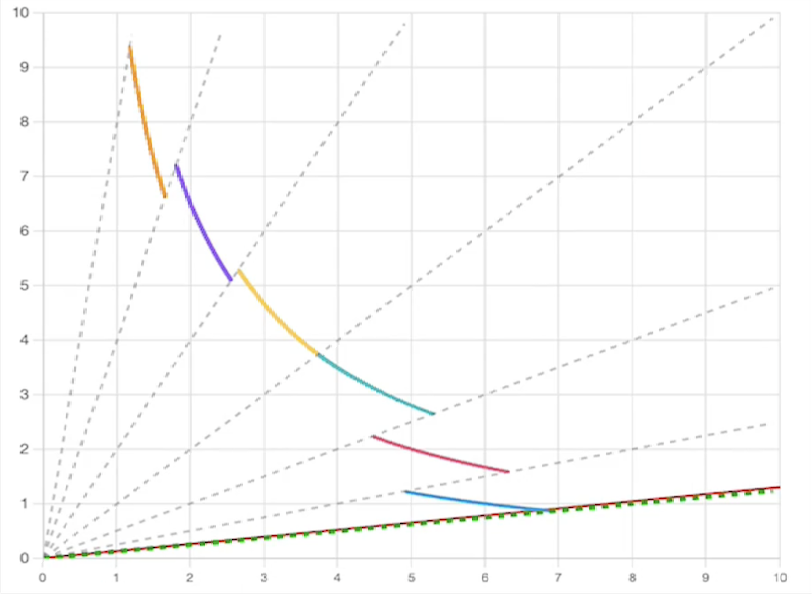
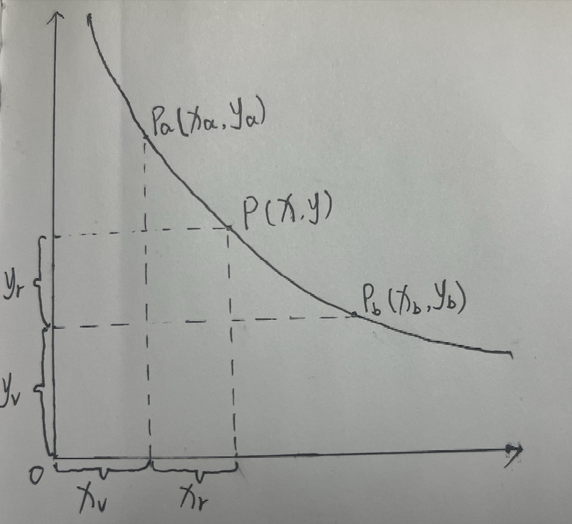

# Uniswap V3 OverView

## uniswap V2 的问题

在 uniswap V2 中，流动性是按照 $x \cdot y = k$ 的价格曲线，在整个价格区间 $(0,\infty)$ 上均匀分布的，也就是池子流动性允许以任何价格进行交易。

但是资产的历史价格会保持在一个确定的范围内，无论这个范围是宽还是窄，例如，ETH 的价格历史价格范围是 0.75 到 4800，USDC 的始终维系在 1 附近。没有人会以 5000 的价格购买一个 ETH。因此在远离当前价格或永远无法到达的价格区间提供流动性毫无意义，下面我们用数学模型来更直观的看看这会导致什么问题？

假设 ETH/USDT 交易对的现货价格为 1500 USDT/ETH，流动性池子中共有资金 4500 USDT 和 3 ETH。

用 x 表示 USDT，y 表示 ETH, $x_1$ = 4500, $y_1$ = 3, k = 13500

**如果价格下跌至 1300 USDT/ETH**, 此时则有：

$$
x_2 \cdot y_2 = 13500
$$

$$
\frac{x_2}{y_2} = 1300
$$

得: $x_2 = 4192.54$, $y_2 = 3.22$，也就是说在 1500 到 1300 这个价格区间，只有 $4500 - 4192.54 = 307.46$ USDT 在支撑流动性

**如果价格上涨至 1700USDT/ETH**, 此时则有：

$$
x_3 \cdot y_3 = 13500
$$

$$
\frac{x_3}{y_3} = 1700
$$

得：x_3 = 4789, y_3 = 2.817, 也就是说在 1500 到 1700 这个价格区间，只有 $3 - 2.817 = 0.183$ ETH 在支撑流动性

从上面的例子中我们可以看出，假设 ETH 的价格在某一段时间内一直在 1300 - 1700 这个区间波动，而流动性被稀释到 $(0,\infty)$ 这个区间，资金利用率非常低，这会导致

- LP 的资金无法被充分利用，大部分流动性在支持无意义的价格区间，躺着发霉，LP 的收益降低
- 在一个 trader 频繁交易的价格区间内，流动性无法被充分利用，增大大额交易的 price impact。

而这个缺点在 USDT/DAT 这类稳定币交易对中会被放大，因为稳定币始终维持的 1 附近，价格区间非常小，资金利用率会进一步降低。为了解决这个问题，uniswap V3 引入了集中流动性。

## 集中流动性

在 uniswap V3 中，一个交易对的整个价格曲线被拆分成多个价格区间，LP 可以选择他们想要提供流动性的价格区间，每个区间都有各自的流动性，这将允许 LP 把更多的流动性投入到活跃的价格区间内，大大提高资金利用率。

### 数学模型

为了理解这种区间化流动性的运作方式，我们可以引入一个数学上的概念———**虚拟流动性**。虚拟流动性并非 LP 实际存入的资产，而是用于参与价格计算的流动性值，并据此构建交易模型。下图展示了某一价格区间内的流动性曲线：

其中点 $P(x, y)$ 表示当前市场价格，点 $P_a(x_a, y_a)$ 与 $P_b(x_b, y_b)$ 是 LP 选择的价格区间边界。

由于 LP 的真实资产仅覆盖价格区间 $[P_a, P_b]$，即：$x_r$，$y_r$。但在恒定乘积公式 $x \cdot y = k$ 的数学计算中，我们需要一条完整的曲线，因此在计算中引入了虚拟流动性来补足区间边缘，即：$x_v$，$y_v$ 。这一机制允许模型持续满足恒定乘积关系，即：

$$
\begin{aligned}
x \cdot y = k\\
(x_v + x_r)(y_v + y_r) = k
\end{aligned}
$$

那么我们该怎么计算某个价格区间需要的虚拟流动性呢？这就需要 下面的公式：

$$
y = L \cdot \sqrt{P}\\
x = \frac{L}{\sqrt{P}}
$$

代入得：

$$
(x_r + \frac{L}{\sqrt{P_a}})(y_r + L \cdot \sqrt{P_b}) = L^2
$$

该公式进一步揭示了 Uniswap V3 的核心机制：在任意价格区间$[P_a,P_b]$定义独立的流动性 $L$，UniswapV3 便能够在区间内构建独立的恒定乘积做市模型。这种“分段式恒定乘积”的结构不仅保留了恒定乘积做市原理，也实现了更高的资金利用率与策略灵活性。

## UniswapV3 的架构

UniswapV3 同样采用了`core-periphery`的分层设计，但相较于 V2，逻辑更复杂。

# core

- **UniswapV3Factory**
  1. 负责创建并注册所有`UniswapV3Pool`，是整个协议的唯一入口。
  2. 管理可用费率档位（如 0.05%、0.3%、1%）和对应的 `tickSpacing`，以及协议手续费开关。
- **UniswapV3Pool**
  采用了集中流动性设计，实现了核心的 AMM 定价逻辑，Swap 执行，LP 头寸管理，实现了 TWAP 等高级功能

# periphery

- **NonfungiblePositionManager**
  在`UniswapV3Pool`合约的基础上，将 LP 头寸用 NFT 表示，并提供了更加友好的 LP 操作入口

- **SwapRouter**
  在`UniswapV3Pool`合约的基础上，封装了复杂的逻辑，确保用户只需要输入路径，数量等简单的参数即可完成交易，支持多跳路径，并封装了回调机制。
