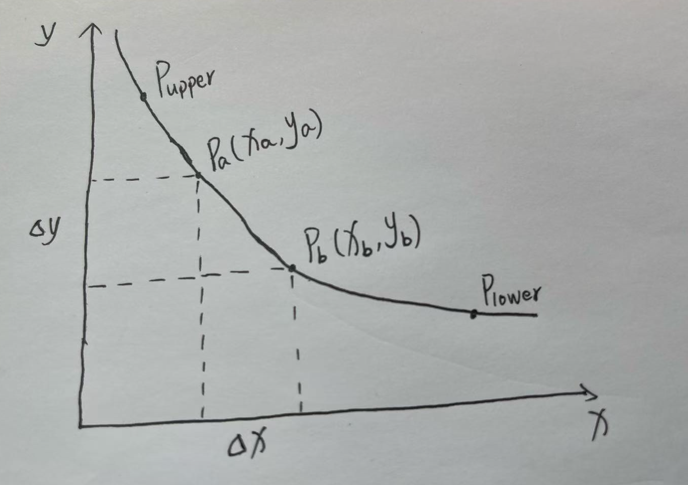

# Uniswap V3 Swap

在 V2 中，swap 逻辑非常简洁：池子合约维护了两种资产储备数量，利用恒定乘积公式 $x \cdot y = k$ ，就可以一步推导出任意一次兑换的结果。但是在 V3 中，流动性不是全局恒定的，而是随着价格区间的不同分段变化的。合约也不再存储 token 的数量，选择存储的状态变量是：

- liquidity ：当前价格所在的 tick 区间的流动性
- sqrtPriceX96 ：当前价格 $\sqrt{P}$的定点数
- liquidityNet : 每个 tick 上的流动性变化量

因此，V3 的 swap 不再像 V2 那样一步套公式，而是一个逐区间推进的过程：

- 在一个区间内，使用当前 $\sqrt{P}$ 和当前价格所在 tick 区间的流动性 $L$ 之间的公式计算兑换
- 当价格将要跨越 tick 时，再根据 liquidityNet 计算下一个区间的流动性 $L$ ,继续下一段的计算

这样设计的好处也是显而易见的：

- 在同一个区间内部 swap，只需要更新 $\sqrt{P}$ , 不需要维护 token 的数量
- 跨区间的时候，只需要计算下一个区间的流动性，而不是调整每个区间的 token 数量
- 上面两点不仅仅减少了合约复杂度，同时也节省了大量 gas，而 token 的数量随时可以用 $\sqrt{P}$ 和 $L$ 的公式推导出来

## 数学模型



因为 V3 的 swap，是一个逐区间推进的过程，每一段 tick 区间内的数学模型都是一样的，所以我们分析 swap 的数学模型的前提是在同一个区间内 swap。假设存在交易对 (x,y)，价格区间是 $[P_{lower},P_{upper}]$ ，此区间的全局流动性为 $L$ 。

1. 卖出 y，得到 x

   当前市场价格为 $P_b$，我们卖出 $\Delta x$ 数量的 x token，计算我们该得到多少数量的 y token？

   假设我们卖出 $\Delta x$ 数量的 x token，导致市场价格上涨至 $P_a$ ，则有：

$$
\Delta x = x_b - x_a = L(\frac{1}{\sqrt{P_b}} - \frac{1}{\sqrt{P_a}})
$$

已知： $\Delta x$ ，$P_b$ ，$L$ ，求 $\sqrt{P_a}$ :

$$
\sqrt{P_a} = \frac{1}{ \frac{1}{\sqrt{P_b}} - \frac{\Delta x}{L} } = \frac{\sqrt{P_b}}{1 - \frac{\Delta x}{L} \sqrt{P_b}}
$$

得到 $\sqrt{P_a}$ , 则可以计算我们得到的 y token 的数量 $\Delta y$ ：

$$
\Delta y = y_a - y_b = L(\sqrt{P_a} - \sqrt{P_b})
$$

2. 卖出 x，得到 y

   当前市场价格为 $P_a$，我们卖出$\Delta y$ 数量的 y token，计算我们该得到多少数量的 x token？

   假设我们卖出$\Delta y$ 数量的 y token，导致市场价格下降至$P_b$，则有：

   $$
   \Delta y = y_a - y_b = L(\sqrt{P_a} - \sqrt{P_b})
   $$

   已知：$\Delta y$，$P_a$，$L$，求 $\sqrt{P_b}$：

   $$
   \sqrt{P_b} = \sqrt{P_a} - \frac{\Delta y}{L}
   $$

   得到$\sqrt{P_b}$，则可以计算我们得到的 x token 的数量 $\Delta x$：

   $$
   \Delta x = x_b - x_a = L(\frac{1}{\sqrt{P_b}} - \frac{1}{\sqrt{P_a}})
   $$

上面就是 V3 的 swap 数学模型，不管是兑换 x 还是 y，我们总是先推算交易者给池子添加 token 后，价格会变化到哪里？然后再根据价格反推出应该支付给交易者多少 token。如果价格变化后跨越了当前 tick，那么在下一 tick 区间重复同样的步骤，直到 swap 完成。

## 源码实现

### 1. 函数入参

```solidity
function swap(
  address recipient,
  bool zeroForOne,
  int256 amountSpecified,
  uint160 sqrtPriceLimitX96,
  bytes calldata data
)
```

- recipient：交易接收地址
- zeroForOne：交易方向，`true`表示 token0 -> token1,`false`表示 token1 -> token0
- amountSpecified：指定交易数量，$>0$表示指定输入，$<0$表示指定输出
- sqrtPriceLimitX96：交易设置的滑点，合约不会把价格推进超过这个值
- data：传递给回调`uniswapV3SwapCallback`的字节

### 2. 前置检查

```solidity
        require(amountSpecified != 0, 'AS');

        Slot0 memory slot0Start = slot0;

        require(slot0Start.unlocked, 'LOK');

        require(
            zeroForOne
                ? sqrtPriceLimitX96 < slot0Start.sqrtPriceX96 && sqrtPriceLimitX96 > TickMath.MIN_SQRT_RATIO
                : sqrtPriceLimitX96 > slot0Start.sqrtPriceX96 && sqrtPriceLimitX96 < TickMath.MAX_SQRT_RATIO,
            'SPL'
        );
        slot0.unlocked = false;
```

- 根据交易方向，校验 sqrtPriceLimitX96 参数
- `slot0.unlocked`是一个全局状态变量，用来防止回调时被重入攻击

### 3. 创建缓存

```solidity
SwapCache memory cache = SwapCache({
    liquidityStart: liquidity,
    blockTimestamp: _blockTimestamp(),
    feeProtocol: zeroForOne ? (slot0Start.feeProtocol % 16) : (slot0Start.feeProtocol >> 4),
    secondsPerLiquidityCumulativeX128: 0,
    tickCumulative: 0,
    computedLatestObservation: false
});
```

`SwapCache` 是 swap 开始时的一些环境快照，用来避免在循环里重复读取链上存储。

- liquidityStart：当前市场价格所在的 tick 区间的全局流动性
- blockTimestamp：当前区块时间戳
- feeProtocol：协议手续费比例。如果是 token0 -> token1，取低四位，如果是 token1 -> token0，取高四位
- secondsPerLiquidityCumulativeX128：初始化为 0，后续在跨越 tick 时更新，用于 oracle 累计
- tickCumulative：初始化为 0，后续在跨越 tick 时更新
- computedLatestObservation：初始化为 false，表示 oracle 数据还没有更新过，在第一次跨越 tick 时重置为 true

### 4. 创建状态机

```solidity
SwapState memory state =
    SwapState({
        amountSpecifiedRemaining: amountSpecified,
        amountCalculated: 0,
        sqrtPriceX96: slot0Start.sqrtPriceX96,
        tick: slot0Start.tick,
        feeGrowthGlobalX128: zeroForOne ? feeGrowthGlobal0X128 : feeGrowthGlobal1X128,
        protocolFee: 0,
        liquidity: cache.liquidityStart
    });
```

`SwapState` 是 在 while 循环中不断更新的状态机。

- amountSpecifiedRemaining：剩余待处理的交易数量（输入 or 输出）。随着循环一步步推进会减少
- amountCalculated：已经计算出的对手 token 的累计数量。最终会作为 swap 的结果返回。
- sqrtPriceX96：当前市场$\sqrt{P}$的定点数
- tick：当前 tick，随着跨越 tick 更新
- feeGrowthGlobalX128：当前交易方向对应的全局每单位流动性产生的累计手续费，如果是 token0 -> token1，取`feeGrowthGlobal0X128`，如果是 token1 -> token0，取`feeGrowthGlobal1X128`
- protocolFee：本次 swap 累计产生的协议费用
- liquidity：当前市场价格所在 tick 区间的流动性，会在跨越 tick 时更新

### 5. 逐 tick 推进 swap

```solidity
    while (state.amountSpecifiedRemaining != 0 && state.sqrtPriceX96 != sqrtPriceLimitX96) {}
```

这段 while 循环代码正是 swap 的核心逻辑，直到`amountSpecifiedRemaining`被消耗完，或者价格到达`sqrtPriceLimitX96`限制。

```solidity
            StepComputations memory step;

            step.sqrtPriceStartX96 = state.sqrtPriceX96;

            (step.tickNext, step.initialized) = tickBitmap.nextInitializedTickWithinOneWord(
                state.tick,
                tickSpacing,
                zeroForOne
            );

            if (step.tickNext < TickMath.MIN_TICK) {
                step.tickNext = TickMath.MIN_TICK;
            } else if (step.tickNext > TickMath.MAX_TICK) {
                step.tickNext = TickMath.MAX_TICK;
            }

            step.sqrtPriceNextX96 = TickMath.getSqrtRatioAtTick(step.tickNext);

```

- 初始化`step`，存放这一轮 swap 的中间状态
- `nextInitializedTickWithinOneWord`按照当前交易方向找到下一个已初始化的 tick，如果没找到就用`MIN_TICK`,`MAX_TICK`兜底
- 计算下一个 初始化的 tick 的 sqrtPriceX96

```solidity
(state.sqrtPriceX96, step.amountIn, step.amountOut, step.feeAmount) = SwapMath.computeSwapStep(
                state.sqrtPriceX96,
                (zeroForOne ? step.sqrtPriceNextX96 < sqrtPriceLimitX96 : step.sqrtPriceNextX96 > sqrtPriceLimitX96)
                    ? sqrtPriceLimitX96
                    : step.sqrtPriceNextX96,
                state.liquidity,
                state.amountSpecifiedRemaining,
                fee
            );
```

`SwapMath.computeSwapStep`这个函数就是对上面数学模型的实现，他的核心就是传入下一个 tick 端点的价格，计算剩下的 amountSpecified 能不能消耗完，如果能消耗完，swap 到这轮就结束了 ，用剩下的 amountSpecified 计算出一个新的价格，再推导出这轮 swap 的 amountOut 和手续费。如果消耗不完，说明还要进行下一个 tick 区间的 swap，那么就按照当前区间的端点 tick，算出这轮 swap 消耗了多少 amountSpecified，对应的 amountOut 和手续费。

```solidity
            if (exactInput) {
                state.amountSpecifiedRemaining -= (step.amountIn + step.feeAmount).toInt256();
                state.amountCalculated = state.amountCalculated.sub(step.amountOut.toInt256());
            } else {
                state.amountSpecifiedRemaining += step.amountOut.toInt256();
                state.amountCalculated = state.amountCalculated.add((step.amountIn + step.feeAmount).toInt256());
            }
```

更新状态机中的剩余待处理交易数量和已经计算出的对手 token 的数量。

```solidity
            if (cache.feeProtocol > 0) {
                uint256 delta = step.feeAmount / cache.feeProtocol;
                step.feeAmount -= delta;
                state.protocolFee += uint128(delta);
            }

            // update global fee tracker
            if (state.liquidity > 0)
                state.feeGrowthGlobalX128 += FullMath.mulDiv(step.feeAmount, FixedPoint128.Q128, state.liquidity);
```

- 从手续费中计算出协议费的抽成
- 更新全局手续费累计

```solidity
if (state.sqrtPriceX96 == step.sqrtPriceNextX96) {
                // if the tick is initialized, run the tick transition
                if (step.initialized) {
                    // check for the placeholder value, which we replace with the actual value the first time the swap
                    // crosses an initialized tick
                    if (!cache.computedLatestObservation) {
                        (cache.tickCumulative, cache.secondsPerLiquidityCumulativeX128) = observations.observeSingle(
                            cache.blockTimestamp,
                            0,
                            slot0Start.tick,
                            slot0Start.observationIndex,
                            cache.liquidityStart,
                            slot0Start.observationCardinality
                        );
                        cache.computedLatestObservation = true;
                    }
                    int128 liquidityNet =
                        ticks.cross(
                            step.tickNext,
                            (zeroForOne ? state.feeGrowthGlobalX128 : feeGrowthGlobal0X128),
                            (zeroForOne ? feeGrowthGlobal1X128 : state.feeGrowthGlobalX128),
                            cache.secondsPerLiquidityCumulativeX128,
                            cache.tickCumulative,
                            cache.blockTimestamp
                        );
                    // if we're moving leftward, we interpret liquidityNet as the opposite sign
                    // safe because liquidityNet cannot be type(int128).min
                    if (zeroForOne) liquidityNet = -liquidityNet;

                    state.liquidity = LiquidityMath.addDelta(state.liquidity, liquidityNet);
                }

                state.tick = zeroForOne ? step.tickNext - 1 : step.tickNext;
            } else if (state.sqrtPriceX96 != step.sqrtPriceStartX96) {
                // recompute unless we're on a lower tick boundary (i.e. already transitioned ticks), and haven't moved
                state.tick = TickMath.getTickAtSqrtRatio(state.sqrtPriceX96);
            }
```

- 如果价格到达 tick 边界：

  执行 ticks.cross 更新流动性，

  tick 设置为边界（tickNext 或 tickNext-1）。

- 如果价格没到边界：

  根据新价格反推当前 tick

#### 更新 solt 状态

```solidity
 if (state.tick != slot0Start.tick) {
            (uint16 observationIndex, uint16 observationCardinality) =
                observations.write(
                    slot0Start.observationIndex,
                    cache.blockTimestamp,
                    slot0Start.tick,
                    cache.liquidityStart,
                    slot0Start.observationCardinality,
                    slot0Start.observationCardinalityNext
                );
            (slot0.sqrtPriceX96, slot0.tick, slot0.observationIndex, slot0.observationCardinality) = (
                state.sqrtPriceX96,
                state.tick,
                observationIndex,
                observationCardinality
            );
        } else {
            // otherwise just update the price
            slot0.sqrtPriceX96 = state.sqrtPriceX96;
        }

        // update liquidity if it changed
        if (cache.liquidityStart != state.liquidity) liquidity = state.liquidity;

        // update fee growth global and, if necessary, protocol fees
        // overflow is acceptable, protocol has to withdraw before it hits type(uint128).max fees
        if (zeroForOne) {
            feeGrowthGlobal0X128 = state.feeGrowthGlobalX128;
            if (state.protocolFee > 0) protocolFees.token0 += state.protocolFee;
        } else {
            feeGrowthGlobal1X128 = state.feeGrowthGlobalX128;
            if (state.protocolFee > 0) protocolFees.token1 += state.protocolFee;
        }
```

循环结束后，将新区间的 liquidity，新的当前价格，新的 tick 写入全局状态，并更新全局手续费，和协议费用。预言机部分将会在另外的章节中学习。

#### 根据交易方向返回 amount0，amount1，转账或回调支付

```solidity
        (amount0, amount1) = zeroForOne == exactInput
            ? (amountSpecified - state.amountSpecifiedRemaining, state.amountCalculated)
            : (state.amountCalculated, amountSpecified - state.amountSpecifiedRemaining);

        // do the transfers and collect payment
        if (zeroForOne) {
            if (amount1 < 0) TransferHelper.safeTransfer(token1, recipient, uint256(-amount1));

            uint256 balance0Before = balance0();
            IUniswapV3SwapCallback(msg.sender).uniswapV3SwapCallback(amount0, amount1, data);
            require(balance0Before.add(uint256(amount0)) <= balance0(), 'IIA');
        } else {
            if (amount0 < 0) TransferHelper.safeTransfer(token0, recipient, uint256(-amount0));

            uint256 balance1Before = balance1();
            IUniswapV3SwapCallback(msg.sender).uniswapV3SwapCallback(amount0, amount1, data);
            require(balance1Before.add(uint256(amount1)) <= balance1(), 'IIA');
        }

        emit Swap(msg.sender, recipient, amount0, amount1, state.sqrtPriceX96, state.liquidity, state.tick);
        slot0.unlocked = true;
```
