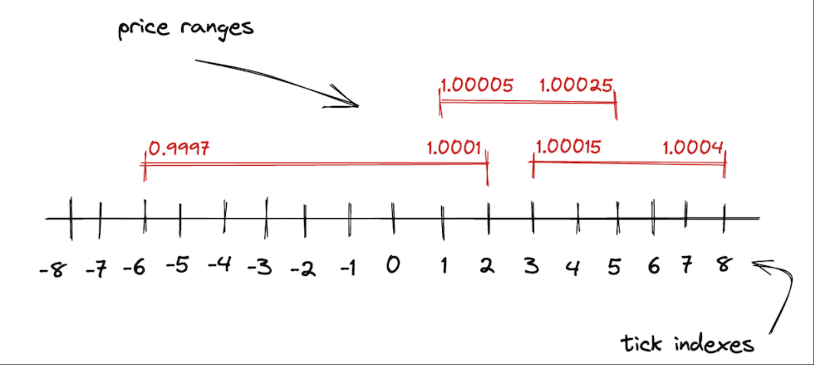
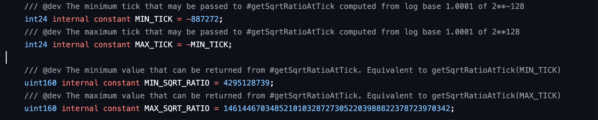

# Uniswap V3 tick

> 在上一章，我们了解了 uniswapV3 引入了集中流动性的概念，LP 可以在某一价格区间内添加流动性。这引出了一个关键问题：**这个价格区间可以随意设置吗？**如果价格区间是可以随意设置的话，会带来什么问题？我们假设现在有 10 万个地址添加了流动性，并且每个地址的价格区间都不一样，那么合约就必须记录和维护每个地址添加流动性的价格区间，这会非常消耗 gas。为了解决这个问题，uniswapV3 引入了**tick**的概念。tick 的设计不仅优化了 gas 成本，还为集中流动性提供了价格刻度，使得流动性分布更加高效和可控。

## tick

tick 是一个离散化价格空间的单位，它将连续的价格空间划分为一系列固定的价格点，使得流动性只能在这些点之间分配。通俗点说，tick 就像是价格的刻度线，把整个价格空间切分成一格一格的，你不能在任意价格点添加流动性，只能在这些刻度之间设定范围。这样做的好处是显而易见的，所有人都在统一的价格刻度上操作，合约只需要记录哪些 tick 被用到了，节省了大量的 gas。

### tick 是怎么跟价格挂钩的？

tick 本质上是价格的对数索引，uniswapV3 不会直接使用价格，而是使用 tick 来标记价格，每个 tick 有一个 index 和对应的价格：

$$
P(i)= 1.0001^i
$$

$P(i)$即为 tick $i$的价格，即 tick 是价格在以 1.0001 为底的对数刻度上的整数索引。每增加一个 tick，价格就乘以 1.0001。



### 为什么要这么做？

1. 价格刻度均匀
   使用 1.0001 的幂次方有一个很好的性质就是：两个相邻的 tick 之间的差距永远是 0.01%或一个基点，这是金融市场中用来衡量百分比的一个单位。金融市场更看重“价格的百分比变化”，比如价格从 100 到 200 涨了 100%，从 200 到 400 也涨了 100%，虽然差值不同的，但重要的是百分比，也就是涨跌幅。使用 tick 可以让价格在对数刻度下分布均匀。
2. 节省 gas，安全
   如果直接操作价格，会涉及大量浮点运算。使用 tick 后，所有价格都映射为整数，价格变化 0.01%就是 tick+1，链上计算更快更安全。

## 源码解读

在理解了 tick 的概念后，开始深入其源码实现，通过学习源码，理解 tick 在池中如何被管理，如何响应价格变化，以及设计背后的技术考虑，为后面的流动性计算和 swap 逻辑奠定基础。这里主要学习三个关于 tick 的核心模块的源码：

- **TickMath**：是一个纯数学库，负责 tick 到 price 的映射，确保价格计算的准确和高效安全
- **Tick**：管理每个 tick 的状态，包括初始化与清理，流动性变化，跨越 tick 处理等逻辑
- **TickBitmap**：提供高效的存储方式，记录或修改 tick 的初始化状态，并支持快速查询

### TickMath

#### 常量



在了解图中定义的常量前，我们需要了解一点，uniswapV3 中实际上并不会使用到价格，而是$\sqrt{P}$。因为在流动性计算和 swap 的数学计算中，使用到更多的是$\sqrt{P}$，并且平方根计算并不精确，会引入取整的问题，所以干脆就在合约中存平方根的结果，而不是计算它。

在 uniswapV3 中存储$\sqrt{P}$时使用的是`uint160`的类型，Q64.96 类型的定点数（即前 64 个字节作为整数部分，后 96 个字节作为小数部分），其本质是$\sqrt{P} \cdot 2^{96}$的整数结果，这个 Q64.96 定点数的能够表示的范围为：$[1,  2^{160} - 1]$（价格为 0 没有意义）。
由于$P(i)= 1.0001^i$，$\sqrt{P}$与 tick 的关系为：$\sqrt{P(i)} = 1.0001 ^{\frac{i}{2}}$，为了让$\sqrt{P}$在 Q64.96 格式中不溢出且有效，需要限制 tick 的取值$i$的范围：

- tick 的最大值

  需要满足 $\sqrt{P(i)} \cdot 2^{96} \leq 2^{160} - 1$，代入$\sqrt{P(i)} = 1.0001 ^{\frac{i}{2}}$，不等式为：$1.0001 ^{\frac{i}{2}} \cdot 2^{96} \leq 2^{160} - 1 \approx 2^{160}$，两边去自然对数并化简后可得：$i \approx 887272$

- tick 的最小值

  需要满足 $\sqrt{P(i)} \cdot 2^{96} \geq 1$，同理，不等式为：$1.0001 ^{\frac{i}{2}} \cdot 2^{96} \geq 1$，即：$1.0001 ^{\frac{i}{2}} \geq 2^{96}$,两边取对数化简后可得：$i \approx -887272$

根据 tick 的取值范围可以算出存储$\sqrt{P}$的 Q64.96 定点数的取值范围：

- Q64.96 定点数的最大值

  代入 tick 的最大值，$1.0001^{\frac{887272}{2}} = 1.0001 ^ {443636}$，转换成 Q64.96 定点数，$1.0001 ^ {443636} \cdot 2^{96} \approx 1461446703485210103287273052203988822378723970342$

- Q64.96 定点数的最小值
  代入 tick 的最小值，$1.0001^{\frac{-887272}{2}} = 1.0001 ^ {-443636}$，转换成 Q64.96 定点数，$1.0001 ^ {-443636} \cdot 2^{96} \approx 4295128739$

上述推导思路简单来说，首先推算 tick 的整数范围，确保$\sqrt{P} \cdot 2^{96}$能够落在 uint160 能够表示的范围内，然后再反推出$\sqrt{P}$的 Q64.96 的整数范围。这就是 TickMath 的定义的常量的由来，MIN_TICK,MAX_TICK 是 tick 的最小值和最大值，MIN_SQRT_RATIO，MAX_SQRT_RATIO 是$\sqrt{P}$的 Q64.96 格式下的最小值和最大值。

> 💡 **PS：**
> 我在学习这个推导过程中的时候，有个疑问：为什么要先确定 tick 的取值范围，然后再计算$\sqrt{p}$的范围？这里需要理解：uniswapV3 的核心创新是，**将连续的价格空间离离散为整数 tick**，每移动一个 tick，价格变化 0.01%，这是整个设计的起点，而$\sqrt{p}$是在这个基础单位在数学运算后的自然结果。通俗说 tick 是因，$\sqrt{p}$是果。
>
> 为什么不能用$\sqrt{p}$的范围反推 tick 的范围？
>
> 1. tick 必须是整数，否则无法做到每移动一个 tick，价格变化 0.01%。而$\sqrt{p}$的范围可能无法对应整数 tick，所以$\sqrt{p}必须迁就整数 tick。
> 2. Q64.96 的限制是被动适配的，而非主动定义，使用 Q64.96 的作用是安全在合约中处理浮点运算，而非定义价格范围，不能本末倒置。

#### getSqrtRatioAtTick

这个函数用于将一个 tick 转换为$\sqrt{P}$的 Q64.96 定点数（之后用 sqrtPriceX96 表示），在数学层面上，给定一个 tick $i$:

$$
\text{sqrtPriceX96} = 1.0001 ^{\frac{i}{2}} \cdot 2^{96}
$$

如果在链上直接执行这样的运算，那是绝对不可行的：EVM 不支持开方运算和浮点数，而且 EVM 也没有原生幂次计算指令，累乘需要 O(i) 次乘法，tick 最大可达 887272，链上执行成本非常高。Uniswap V3 的巧妙之处在于 **快速幂 + 预计算常量**：将 tick 的二进制位展开，每一位为 1 时乘以预先算好的 $\sqrt{1.0001^{2^k}}$ 常量，最终只需 O(log i) 次乘法，就能安全、高效地得到 sqrtPriceX96。

_快速幂思想_

假设要计算$a^n$,指数的二进制表示：$n = b_k b_{k-1} \dots b_1 b_0 \quad (\text{二进制})$，每一位$b_i = 0$ 或 1，则：

$$
a^n = a^{b_0 \cdot 2^0} \cdot a^{b_1 \cdot 2^1} \cdot \dots \cdot a^{b_k \cdot 2^k}
$$

举例：计算$a^{13}$

- 13 的二进制是 `1101`

拆解每一位：

- bit0 = 1 → 乘 $a^{2^0} = a^1$
- bit1 = 0 → 跳过
- bit2 = 1 → 乘 $a^{2^2} = a^4$
- bit3 = 1 → 乘 $a^{2^3} = a^8$

最终乘积：$a^1 \cdot a^4 \cdot a^8 = a^{13}$，只需要 3 次乘法（对应 bit = 1），而不是 13 次。

快速幂的核心思想就是：利用指数的二进制，把幂次拆成按位累乘（只对二进制为 1 的位累乘对应幂次的值），可大幅减少累乘次数。

_预计算常量_

上面的快速幂思想虽然大幅减少了累乘次数，但是每一位还是要做指数级别的累乘，uniswapV3 用预计算常量做到极致的优化。我们用快速幂的思想拆解这个公式：$\text{sqrtPriceX96} = 1.0001 ^{\frac{i}{2}} \cdot 2^{96}$，可得：

$$
\text{sqrtPriceX96} = \sqrt{1.0001^{2^0 \cdot {b_0}}} ⋅ \sqrt{1.0001^{2^1 \cdot {b_1}}} ⋅ \sqrt{1.0001^{2^2 \cdot {b_2}}}  ⋅ … ⋅ \sqrt{1.0001^{2^k \cdot {b_k}}} ⋅ 2^{96}
$$

观察上面的公式，可以发现每一位的$\sqrt{1.0001^{2^k \cdot {b_k}}}$都是可以提前计算出来的，我们只需要根据每一位是 0 或 1，选择跳过或者将提前计算好的结果作为常量累乘上去即可，这就是预计算常量思想，tick 的最大值是 887272，二进制最多 20 位，也就是说最多只需要 20 次乘法，就能安全、高效地得到 sqrtPriceX96，真是太巧妙了！

_代码解读_

```solidity
function getSqrtRatioAtTick(int24 tick) internal pure returns (uint160 sqrtPriceX96) {
    // Step 1: 取 tick 的绝对值，便于快速幂累乘
    uint256 absTick = tick < 0 ? uint256(-int256(tick)) : uint256(int256(tick));
    require(absTick <= uint256(MAX_TICK), 'T'); // 检查tick边界

    // Step 2: 初始化 ratio
    // 第 0 位tick的二进制：如果为 1，乘上预计算常量 sqrt(1.0001^(2^0))
    //              如果为 0，保持 1
    uint256 ratio = absTick & 0x1 != 0
        ? 0xfffcb933bd6fad37aa2d162d1a594001   // C_0 = sqrt(1.0001^(2^0))
        : 0x100000000000000000000000000000000; // 1

    // Step 3: 从第 1 位tick的二进制开始，遍历每一位二进制，按预先计算好的常量进行快速幂累乘
    // 这里要注意，ratio是Q128.128的定点数，所有计算好的常量C_0,C_1,C_2 … C_19,包括上面的1，也都是Q128.128的定点数，
    // 所以每次累乘后都需要做右移128，把结果缩放回原始定点数的精度
    if (absTick & 0x2 != 0) ratio = (ratio * 0xfff97272373d413259a46990580e213a) >> 128; // C_1
    if (absTick & 0x4 != 0) ratio = (ratio * 0xfff2e50f5f656932ef12357cf3c7fdcc) >> 128; // C_2
    if (absTick & 0x8 != 0) ratio = (ratio * 0xffe5caca7e10e4e61c3624eaa0941cd0) >> 128; // C_3
    if (absTick & 0x10 != 0) ratio = (ratio * 0xffcb9843d60f6159c9db58835c926644) >> 128; // C_4
    if (absTick & 0x20 != 0) ratio = (ratio * 0xff973b41fa98c081472e6896dfb254c0) >> 128; // C_5
    if (absTick & 0x40 != 0) ratio = (ratio * 0xff2ea16466c96a3843ec78b326b52861) >> 128; // C_6
    if (absTick & 0x80 != 0) ratio = (ratio * 0xfe5dee046a99a2a811c461f1969c3053) >> 128; // C_7
    if (absTick & 0x100 != 0) ratio = (ratio * 0xfcbe86c7900a88aedcffc83b479aa3a4) >> 128; // C_8
    if (absTick & 0x200 != 0) ratio = (ratio * 0xf987a7253ac413176f2b074cf7815e54) >> 128; // C_9
    if (absTick & 0x400 != 0) ratio = (ratio * 0xf3392b0822b70005940c7a398e4b70f3) >> 128; // C_10
    if (absTick & 0x800 != 0) ratio = (ratio * 0xe7159475a2c29b7443b29c7fa6e889d9) >> 128; // C_11
    if (absTick & 0x1000 != 0) ratio = (ratio * 0xd097f3bdfd2022b8845ad8f792aa5825) >> 128; // C_12
    if (absTick & 0x2000 != 0) ratio = (ratio * 0xa9f746462d870fdf8a65dc1f90e061e5) >> 128; // C_13
    if (absTick & 0x4000 != 0) ratio = (ratio * 0x70d869a156d2a1b890bb3df62baf32f7) >> 128; // C_14
    if (absTick & 0x8000 != 0) ratio = (ratio * 0x31be135f97d08fd981231505542fcfa6) >> 128; // C_15
    if (absTick & 0x10000 != 0) ratio = (ratio * 0x9aa508b5b7a84e1c677de54f3e99bc9) >> 128; // C_16
    if (absTick & 0x20000 != 0) ratio = (ratio * 0x5d6af8dedb81196699c329225ee604) >> 128; // C_17
    if (absTick & 0x40000 != 0) ratio = (ratio * 0x2216e584f5fa1ea926041bedfe98) >> 128; // C_18
    if (absTick & 0x80000 != 0) ratio = (ratio * 0x48a170391f7dc42444e8fa2) >> 128; // C_19

    // Step 4: tick 为正数时，取倒数
    if (tick > 0) ratio = type(uint256).max / ratio;

    // Step 5: 转换 Q128.128 -> Q64.96 并向上取整
    sqrtPriceX96 = uint160((ratio >> 32) + (ratio % (1 << 32) == 0 ? 0 : 1));
}
```

#### getTickAtSqrtRatio

这个函数用于将一个 sqrtPriceX96 转换为对应的 tick，在数学层面上，给定一个 sqrtPriceX96：

$$
\text{tick} = 2 \cdot \log_{1.0001}\left(\frac{\text{sqrtPriceX96}}{2^{96}}\right)
$$

这个公式中计算的难点是$log_{1.0001}$，因为在 EVM 中不支持对数运算和浮点数。我们知道，二进制表示是基于 2 的整数幂次方，$log_2(x)$可以直接和二进制匹配。所以 UniswapV3 的解决方案是：通过换底公式，将上面的公式转换成计算$log_2(x)$，用 MSB 确定$log_2(x)$的整数部分，移位后二分法逼近算出小数部分。

_换底公式转换_

在数学中，对数运算中的换底公式如下：

$$
log_a b = \frac{\log_c b}{\log_c a}
$$

将$log_{1.0001}$转换成$log_2$，则有：

$$
log_{1.0001} \left(\frac{\text{sqrtPriceX96}}{2^{96}}\right) = \frac{\log_2 \left(\frac{\text{sqrtPriceX96}}{2^{96}}\right)}{\log_2 1.0001}
$$

拆开分数部分：

$$
log_2 \left(\frac{\text{sqrtPriceX96}}{2^{96}}\right) = \log_2 (\text{sqrtPriceX96}) - \log_2 (2^{96}) = \log_2 (\text{sqrtPriceX96}) - 96
$$

最终公式：

$$
\text{tick} = \frac{2 \cdot \left( \log_2 (\text{sqrtPriceX96}) - 96 \right)}{\log_2 1.0001}
$$

观察这个公式，$log_2 1.0001$是一个定值，可以预计算。重点在如何处理 $log_2 (\text{sqrtPriceX96})$。

_处理 log2 运算_

- 任何正数都可以拆成“2 的整数次幂 乘以 一个 $[1,2)$ 之间的数”
  - 5 可以写成 4 x 1.25，其中 4 是 $2^2$(2 的整数次幂)，1.25 是介于[1,2)之间的数，即 $5 = 2^2 \cdot 1.25$
  - 0.3 可以写成 0.25 x 1.2，其中 0.25 是 $2^{-2}$(2 的负整数次幂)，1.2 是介于[1,2)之间的数，即 $0.3 = 2^{-2} \cdot 1.2$
- $log_2(x) = \text{整数部分} + \text{小数部分}$

  根据对数的运算法则：$log_2(a \cdot b) = \log_2(a) + \log_2(b)$
  由于上面提到任何正数都可以拆成“2 的整数次幂 乘以 一个 $[1,2)$ 之间的数的性质，如果$x$拆成 $2^n \cdot m$后，自然变成：
  $$log_2(x) = \log_2(2^n) + \log_2(m) = n + \log_2(m)$$
  n 就是$log_2(x)$的整数部分，$log_2(m)$是$log_2(x)$的小数部分（因为 m 在 [1,2)之间，$log_2(1) = 0$，$log_2(2) = 1$，所以 $log_2(m)$ 一定在 [0,1)之间）。

- 找到 n 和 m

  1.  找 n（整数部分）

      因为二进制表示和 log2 的定义是天然一致的，二进制中的最高有效位（MSB）：二进制中最左边的那个 “1” 所在的位置，等于$log_2(x)$的整数部分

      - 5 的二进制表示 “101”，MSB 为 2，$log_2(5)$ 的整数部分也是 2
      - 8 的二进制表示 “1000”，MSB 为 3，$log_2(8)$ 的整数部分也是 3

  2.  求 $log_2(m)$

      找到 n 后，把 x 除以 $2^n$，得到的结果就是 m

      - 把 m 的范围进一步细分

        m 在 [1,2)之间，这个区间是连续的，但计算机无法直接计算所有可能的值的 log2。uniswapV3 的解法是：在这个区间内均匀插入 16 个离散点（比如 1.0，1.0625，1.125...），这些点的间隔是 1/16 = 0.0625。每个点的 log2 都是预计算好的。

      - 定位 m 落在哪个细分区间

        对于任意 m，先确定它落在哪两个相邻的预计算点之间，快速锁定相邻的两个预计算点（记为 a 和 b，对应的 log2 值记为 logA 和 logB）

      - 计算$log_2(m)$ 近似值

        因为 $log_2(m)$ 在 [1, 2) 区间内是一条曲线，但在很小的区间内(比如 a 到 b 仅差 0.0625)，可以近似的看作一条直线。$log_2(m)$ 的近似值为：

        $$
        log_2(m) \approx log_A + \frac{m - a}{b-a} \cdot (log_B - log_A)
        $$

        - $m-a$：m 到左锚点 a 的距离
        - $b-a$：两个锚点之间的总距离（uniswapV3 中固定位 0，0625）
        - $\frac{m - a}{b-a}$：m 在 a 到 b 区间中的位置占比
        - $log_B - log_A$：两个锚点的 log2 差值
        - 整体含义：用 m 的位置占比，去分配 log2 的差值，再加上左锚点的 logA，近似得到$log_2(m)$的值

_源码解读_

```solidity
function getTickAtSqrtRatio(uint160 sqrtPriceX96) internal pure returns (int24 tick) {
    // Step 1: 输入边界检查
    require(sqrtPriceX96 >= MIN_SQRT_RATIO && sqrtPriceX96 < MAX_SQRT_RATIO, 'R');

    // Step 2: 把 Q64.96 -> Q128.128 形式（左移 32）
    // 这样后续的平方、位移等操作都在 256 位空间完成，保留更多精度
    uint256 ratio = uint256(sqrtPriceX96) << 32;

    // Step 3: 用 r 和 msb 寻找最高有效位（MSB），用于估算 log2 的整数部分
    uint256 r = ratio;
    uint256 msb = 0;

    // 下面一系列 assembly 使用二分法累加256位的ratio的最高有效位（128，64，32...2,1）
    assembly {
        let f := shl(7, gt(r, 0xFFFFFFFFFFFFFFFFFFFFFFFFFFFFFFFF))
        msb := or(msb, f)
        r := shr(f, r)
    }
    assembly {
        let f := shl(6, gt(r, 0xFFFFFFFFFFFFFFFF))
        msb := or(msb, f)
        r := shr(f, r)
    }
    assembly {
        let f := shl(5, gt(r, 0xFFFFFFFF))
        msb := or(msb, f)
        r := shr(f, r)
    }
    assembly {
        let f := shl(4, gt(r, 0xFFFF))
        msb := or(msb, f)
        r := shr(f, r)
    }
    assembly {
        let f := shl(3, gt(r, 0xFF))
        msb := or(msb, f)
        r := shr(f, r)
    }
    assembly {
        let f := shl(2, gt(r, 0xF))
        msb := or(msb, f)
        r := shr(f, r)
    }
    assembly {
        let f := shl(1, gt(r, 0x3))
        msb := or(msb, f)
        r := shr(f, r)
    }
    assembly {
        let f := gt(r, 0x1)
        msb := or(msb, f)
    }

    // Step 4: 使用 msb 将 ratio 归一化到 [2^127, 2^128) 区间，便于后续小数部分逼近
    if (msb >= 128) r = ratio >> (msb - 127);
    else r = ratio << (127 - msb);

    // Step 5: 初始化 log2 的定点表示（Q64 — 整数部分）
    // (msb - 128) 是相对偏移，把它左移 64 得到 Q64.64 表示（后面会扩展成 Q128.128）
    int256 log_2 = (int256(msb) - 128) << 64;

    // Step 6: 通过 14 次迭代（每次平方并判定）逼近 log2 的小数部分（得到约 14 bit 的小数精度）
    // 每个 assembly block 都做： r = r*r >> 127; if (r >= 2^128) { r >>= 1; log_2 |= (1 << (63 - i)); }
    assembly {
        r := shr(127, mul(r, r))
        let f := shr(128, r)
        log_2 := or(log_2, shl(63, f))
        r := shr(f, r)
    }
    assembly {
        r := shr(127, mul(r, r))
        let f := shr(128, r)
        log_2 := or(log_2, shl(62, f))
        r := shr(f, r)
    }
    assembly {
        r := shr(127, mul(r, r))
        let f := shr(128, r)
        log_2 := or(log_2, shl(61, f))
        r := shr(f, r)
    }
    assembly {
        r := shr(127, mul(r, r))
        let f := shr(128, r)
        log_2 := or(log_2, shl(60, f))
        r := shr(f, r)
    }
    assembly {
        r := shr(127, mul(r, r))
        let f := shr(128, r)
        log_2 := or(log_2, shl(59, f))
        r := shr(f, r)
    }
    assembly {
        r := shr(127, mul(r, r))
        let f := shr(128, r)
        log_2 := or(log_2, shl(58, f))
        r := shr(f, r)
    }
    assembly {
        r := shr(127, mul(r, r))
        let f := shr(128, r)
        log_2 := or(log_2, shl(57, f))
        r := shr(f, r)
    }
    assembly {
        r := shr(127, mul(r, r))
        let f := shr(128, r)
        log_2 := or(log_2, shl(56, f))
        r := shr(f, r)
    }
    assembly {
        r := shr(127, mul(r, r))
        let f := shr(128, r)
        log_2 := or(log_2, shl(55, f))
        r := shr(f, r)
    }
    assembly {
        r := shr(127, mul(r, r))
        let f := shr(128, r)
        log_2 := or(log_2, shl(54, f))
        r := shr(f, r)
    }
    assembly {
        r := shr(127, mul(r, r))
        let f := shr(128, r)
        log_2 := or(log_2, shl(53, f))
        r := shr(f, r)
    }
    assembly {
        r := shr(127, mul(r, r))
        let f := shr(128, r)
        log_2 := or(log_2, shl(52, f))
        r := shr(f, r)
    }
    assembly {
        r := shr(127, mul(r, r))
        let f := shr(128, r)
        log_2 := or(log_2, shl(51, f))
        r := shr(f, r)
    }
    assembly {
        r := shr(127, mul(r, r))
        let f := shr(128, r)
        log_2 := or(log_2, shl(50, f))
    }

    // Step 7: 换底并把表示扩到 Q128.128
    // 用换底把 log2 -> log_{sqrt(1.0001)}，乘以常数 255738958999603826347141（≈ (1 / log2(1.0001)) * 2^128）
    int256 log_sqrt10001 = log_2 * 255738958999603826347141; // Q128.128 表示

    // Step 8: 根据定点 log 值估算两个候选 tick（low / hi）作为边界
    // 这两个常数是偏移量以保证误差边界（源码用的常量）
    int24 tickLow = int24((log_sqrt10001 - 3402992956809132418596140100660247210) >> 128);
    int24 tickHi  = int24((log_sqrt10001 + 291339464771989622907027621153398088495) >> 128);

    // Step 9: 最终选择：如果 tickHigh 对应的 sqrtPrice 不超过输入，返回 tickHigh，否则返回 tickLow
    // （保证返回最大满足 getSqrtRatioAtTick(tick) <= sqrtPriceX96 的 tick）
    tick = tickLow == tickHi ? tickLow : (getSqrtRatioAtTick(tickHi) <= sqrtPriceX96 ? tickHi : tickLow);
}

```

### TickBitMap

在 uniswapV3 中，流动性是分布在不同的价格区间，在执行一笔 swap 的时候，不能直接算一个目标 tick，必须从当前 tick 开始，逐区间迭代，累积流动性，直到满足交易数量，中间还需要跳过无流动性的区域。这就需要我们为所有 tick 建立高效的索引。

uniswapV3 的办法是：使用 bitMap 这种数据结构来存储 tick 的状态。具体来说：

- 使用`mapping(int16=> uint256) pulic tickBitmap`来记录所有 tick 的状态
- 用 tick 的值除以 256（右移 8 位）作为 wordPosition，用 tick 的值对 256 取余作为 bitPosition
- wordPosition 对应 tickBitmap 中 int16 的值，然后在对应的 uint256 这个字节数组中找到下标为 bitPosition 的位置，如果这个 tick 已经初始化流动性，则该位为 1，反之为 0


#### flipTick

这个函数非常简单，用来切换 tick 的状态（标记初始化/清空初始化）

```solidity
function flipTick(
    mapping(int16 => uint256) storage self,
    int24 tick,
    int24 tickSpacing
) internal {
    // 确保 tick 落在合法的间隔上（Uniswap V3 只允许 tick 为 tickSpacing 的整数倍）
    require(tick % tickSpacing == 0);

    // 定位 tick 在 TickBitmap 中的位置：
    //这里注意：如果直接用 tick 当作索引，那 bitmap 就会超级稀疏，浪费存储。所在在TickBitmap中只存储tick / tickSpacing，每一位都是有效的tick
    (int16 wordPos, uint8 bitPos) = position(tick / tickSpacing);

    // 构造一个掩码（mask），只有 bitPos 对应的位置是 1，其余位都是 0
    uint256 mask = 1 << bitPos;

    // 利用按位异或 来“翻转”这一位：
    // - 如果原来是 0，就变成 1（表示该 tick 第一次被用作区间端点）
    // - 如果原来是 1，就变成 0（表示该 tick 上的流动性已经清空）
    // 这就是函数名 flipTick 的由来 —— 切换 tick 的开关状态
    self[wordPos] ^= mask;
}
```

#### nextInitializedTickWithinOneWord

在 swap 的过程中，我们需要找到当前 tick 左边或者右边的下一个有流动性的 tick，使用 bitmap 索引来找到这个 tick，这就是这个函数的作用。

```solidity
    /// @param self TickBitmap mapping
    /// @param tick 当前 tick 值
    /// @param tickSpacing tick 对齐间隔
    /// @param lte true 表示往左查找 <= tick，false 表示往右查找 > tick
    /// @return next 找到或临界的下一个 tick
    /// @return initialized 是否在同一个 word 内找到初始化 tick
    function nextInitializedTickWithinOneWord(
        mapping(int16 => uint256) storage self,
        int24 tick,
        int24 tickSpacing,
        bool lte
    ) internal view returns (int24 next, bool initialized) {
        // 处理负数向下取整
        //Solidity 默认：-17 / 10 = -1（向零取整）
        //正确的逻辑应该是：-17 应该属于 -20 这个格子 → -17/10 = -2 才对。
        int24 compressed = tick / tickSpacing;
        if (tick < 0 && tick % tickSpacing != 0) compressed--;

        // 定位 word 和 bit
        (int16 wordPos, uint8 bitPos) = position(compressed);
        uint256 bitmap = self[wordPos]; // 取出这一 word 的所有状态

        if (lte) {
            // 向左查：
            //构造从[0...bitpos]全是1的掩码
            uint256 mask = (uint256(1) << (bitPos + 1)) - 1;
            //做与运算，截取[0...bitpos]
            uint256 masked = bitmap & mask;

            initialized = masked != 0; // 是否有初始化的 tick
            if (initialized) {
                // 找到最高位的 1 的位置
                uint8 msb = BitMath.mostSignificantBit(masked);
                // 计算距离，定位真正的 tick
                int24 delta = int24(bitPos) - int24(msb);
                next = (compressed - delta) * tickSpacing;
            } else {
                // 没找到，返回当前 word 的最左端，方便上层逻辑继续查找
                next = (compressed - int24(bitPos)) * tickSpacing;
            }
        } else {
            // 向右查
            //构造从[bitpos+1,255]全是1的掩码
            uint256 mask = ~((uint256(1) << (bitPos + 1)) - 1);
            //做与运算，截取[bitpos+1,255]
            uint256 masked = bitmap & mask;

            initialized = masked != 0;
            if (initialized) {
                // 找到最低位的 1 的位置
                uint8 lsb = BitMath.leastSignificantBit(masked);
                int24 delta = int24(lsb) - int24(bitPos);
                next = (compressed + delta) * tickSpacing;
            } else {
                // 没找到，返回当前 word 的最右端，方便上层逻辑继续查找
                next = (compressed + int24(255 - bitPos)) * tickSpacing;
            }
        }
    }
```

### Tick

每个 tick 不仅仅是一个边界点，还记录了该点上与流动性、手续费相关的重要信息。当价格穿越某个 tick 时，系统必须正确更新这些信息，否则会导致流动性和手续费计算出错。下面我们将详细分析`Tick`合约。

#### tick 结构

```solidity
    struct Info {
        uint128 liquidityGross;
        int128 liquidityNet;
        uint256 feeGrowthOutside0X128;
        uint256 feeGrowthOutside1X128;
        int56 tickCumulativeOutside;
        uint160 secondsPerLiquidityOutsideX128;
        uint32 secondsOutside;
        bool initialized;
    }
```

- liquidityGross

  liquidityGross 的定义是：**某个 tick 上绑定了多少流动性的引用计数**。

  这听起来好像很难懂，我们可以想象一下 LP 在某一个价格区间[tickLower,tickUpper]添加了流动性，也就是这个 LP 的持有的头寸（以下简称 position），我们需要在[tickLower,tickUpper]对应的两个 tick 上初始化状态。一个 tick 可能是很多个 position 的端点（tickLower 或 tickUpper），当 position 被创建或者移除（LP 添加或移除流动性）的时候，需要知道还有没有别的 position 也把端点绑在这里。liquidityGross 就是这个计数器（以流动性量为单位，而不是 position 个数），用来跟踪**有多少 position 把端点设在这个 tick 上**，从而决定 tick 的初始化状态。

  liquidityGross 变为 0，说明没有任何 position 以此 tick 为端点，可以把此 tick 的状态信息从 storage 清空，并调用 TickBitmap 中的 flipTick 把这一位清掉。合约不可能在每次都去遍历所有的 position 来判断是否还有绑定此 tick 的 position，liquidityGross 提供了 O(1)的判定。

- liquidityNet

  liquidityNet 的定义是：**跨越这个 tick 时，活跃的流动性增加或减少的净变化量**。

  - 如果 tick 是 position 的上界，liquidityNet += position 的流动性
  - 如果 tick 是 position 的下界，liquidityNet -= position 的流动性

  如何高效的维护区间的流动性？如果直接存储每个 tick 点的流动性，会占用巨量存储，并且添加或删除 position 的 gas 成本会非常昂贵。uniswapV3 用了**差分数组**的思想，用 liquidityNet 来存储跨越区间端点时流动性的变化量，这样避免了存储并维护整条价格曲线上的 tick。

  这样，每次 Mint/Burn 只改两个 tick 的 liquidityNet 值（O(1)），想知道任意价格区间的活跃流动性，只需从左往右累加 liquidityNet，O(n) 扫描即可，无需遍历每个 position。

- feeGrowthOutside0X128/feeGrowthOutside1X128

  这两个字段的定义是：token0/token1 在该 tick 上记录的、相对于当前价格的“区间外手续费累计量”。它的具体方向（左/右）会在价格穿越 tick 时翻转。

  换句话说，它是一个相对字段：

  - 当价格 < tick 时，feeGrowthOutside 表示 tick 右边的手续费累计量
  - 当价格 ≥ tick 时，feeGrowthOutside 表示 tick 左边的手续费累计量

  而 这种“自动切换”正是通过 `cross`函数中 的 global - oldValue 翻转实现的。

  在 uniswapV3 中，LP 的 position 是分布在各个区间[tickLower, tickUpper]上的，所以必须精确计算出各个区间产生的手续费。如果在区间内逐笔累计，成本太高。uniswapV3 采取这种差分法只需要 O(1)的运算，就能算出某个区间的手续费。计算逻辑会在下面`getFeeGrowthInside`函数中详细分析。

- initialized
  uniswapV3 并不会存储所有的 tick，只有 LP 在某个 tick 上设定为头寸边界的时候，才有必要管理这个 tick，这将节省大量存储空间。当 initialized 为 ture，说明该 tick 已经被 LP 使用，对应 tickBitmap 中索引位为 1。当 initialized 为 false，说明该 tick 没有绑定任何流动性（liquidityGross = 0），同时 TickBitmap 里相应的 bit 被清除。未来有 LP 再次使用此 tick，重置为 true 即可。

#### getFeeGrowthInside

上面我们知道，feeGrowthOutside0X128/feeGrowthOutside1X128 这两个字段记录了：相对于当前价格的区间外手续费累计量，并在价格跨越此 tick 时更新这个值。如果我们想知道某个区间[tickLower, tickUpper] 累计的手续费 `feeGrowthInside` ，就需要用全局的手续费累计量减去 tickLower 左边区间手续费累计量，再减去 tickUpper 右边区间手续费累计量，可以用下面的公式表示：

$$
feeGrowthInside = feeGrowthGlobal - feeGrowthBelow - feeGrowthAbove
$$

看看源码是如何实现：

```solidity
    function getFeeGrowthInside(
        mapping(int24 => Tick.Info) storage self, // 所有 tick 的状态
        int24 tickLower,                          // 区间下界
        int24 tickUpper,                          // 区间上界
        int24 tickCurrent,                        // 当前价格所在 tick
        uint256 feeGrowthGlobal0X128,             // token0 的全局手续费累计
        uint256 feeGrowthGlobal1X128              // token1 的全局手续费累计
    ) internal view returns (
        uint256 feeGrowthInside0X128,             // 区间内 token0 的手续费累计
        uint256 feeGrowthInside1X128              // 区间内 token1 的手续费累计
    ) {
        // 取出下界和上界的 tick 信息
        Info storage lower = self[tickLower];
        Info storage upper = self[tickUpper];

        // ---------------------------
        // 1. 计算区间下界左边的累计（feeGrowthBelow）
        // ---------------------------
        uint256 feeGrowthBelow0X128;
        uint256 feeGrowthBelow1X128;
        if (tickCurrent >= tickLower) {
            // 如果当前价格在 tickLower 右边（即区间内部或上方）
            // 那么 tickLower.feeGrowthOutside 就等于tickLower左边的累计
            feeGrowthBelow0X128 = lower.feeGrowthOutside0X128;
            feeGrowthBelow1X128 = lower.feeGrowthOutside1X128;
        } else {
            // 如果当前价格在 tickLower 左边
            // 那么 tickLower.feeGrowthOutside 记录的是tickLower右边的累计
            // 所以需要用 global - outside 得到tickLower左边的累计
            feeGrowthBelow0X128 = feeGrowthGlobal0X128 - lower.feeGrowthOutside0X128;
            feeGrowthBelow1X128 = feeGrowthGlobal1X128 - lower.feeGrowthOutside1X128;
        }

        // ---------------------------
        // 2. 计算区间上界右边的累计（feeGrowthAbove）
        // ---------------------------
        uint256 feeGrowthAbove0X128;
        uint256 feeGrowthAbove1X128;
        if (tickCurrent < tickUpper) {
            // 如果当前价格在 tickUpper 左边（即区间内部或下方）
            // 那么 tickUpper.feeGrowthOutside 就等于tickUpper右边的累计
            feeGrowthAbove0X128 = upper.feeGrowthOutside0X128;
            feeGrowthAbove1X128 = upper.feeGrowthOutside1X128;
        } else {
            // 如果当前价格在 tickUpper 右边
            // 那么 tickUpper.feeGrowthOutside 记录的是tickUpper左边的累计
            // 所以需要用 global - outside 得到tickUpper右边的累计
            feeGrowthAbove0X128 = feeGrowthGlobal0X128 - upper.feeGrowthOutside0X128;
            feeGrowthAbove1X128 = feeGrowthGlobal1X128 - upper.feeGrowthOutside1X128;
        }

        // ---------------------------
        // 3. 用公式算出区间内部的累计
        // feeGrowthInside = feeGrowthGlobal - feeGrowthBelow - feeGrowthAbove
        // ---------------------------
        feeGrowthInside0X128 = feeGrowthGlobal0X128 - feeGrowthBelow0X128 - feeGrowthAbove0X128;
        feeGrowthInside1X128 = feeGrowthGlobal1X128 - feeGrowthBelow1X128 - feeGrowthAbove1X128;
    }
```

#### update

这个函数是`Tick.info`的初始化和更新核心逻辑。

```solidity
function update(
        mapping(int24 => Tick.Info) storage self,
        int24 tick,
        int24 tickCurrent,
        int128 liquidityDelta,
        uint256 feeGrowthGlobal0X128,
        uint256 feeGrowthGlobal1X128,
        uint160 secondsPerLiquidityCumulativeX128,
        int56 tickCumulative,
        uint32 time,
        bool upper,
        uint128 maxLiquidity
    ) internal returns (bool flipped) {
        Tick.Info storage info = self[tick];

        // 1️.计算 liquidityGross
        uint128 liquidityGrossBefore = info.liquidityGross;
        uint128 liquidityGrossAfter = LiquidityMath.addDelta(liquidityGrossBefore, liquidityDelta);

        require(liquidityGrossAfter <= maxLiquidity, 'LO'); // 防止溢出

        // 2. 如果liquidityGross发生了0和非0之间的变化，需要在 TickBitmap 里 flip 一下）
        flipped = (liquidityGrossAfter == 0) != (liquidityGrossBefore == 0);

        // 3. 如果这个 tick 是第一次被用（之前的 liquidityGross = 0），需要初始化
        if (liquidityGrossBefore == 0) {
            if (tick <= tickCurrent) {
                // 记录初始化时的feeGrowthGlobal，作为 outside 的快照
                info.feeGrowthOutside0X128 = feeGrowthGlobal0X128;
                info.feeGrowthOutside1X128 = feeGrowthGlobal1X128;
                info.secondsPerLiquidityOutsideX128 = secondsPerLiquidityCumulativeX128;
                info.tickCumulativeOutside = tickCumulative;
                info.secondsOutside = time;
            }
            info.initialized = true; // 标记 tick 已经激活
        }

        // 4. 更新 tick 的流动性数据
        info.liquidityGross = liquidityGrossAfter;

        // 5. 更新 liquidityNet：
        // - 如果是上界：跨过时要减去流动性
        // - 如果是下界：跨过时要加上流动性
        info.liquidityNet = upper
            ? int256(info.liquidityNet).sub(liquidityDelta).toInt128()
            : int256(info.liquidityNet).add(liquidityDelta).toInt128();
    }
```
